# AI로 고퀄리티 이미지와 콘텐츠 생성하기

> 지난 1회차에서 우리는 생성형 AI의 "엔진"을 이해했다. 이번 회차는 그 엔진이 **이미지라는 감각**을 가질 때 무엇이 달라지는지, 그리고 그것을 어떻게 쓸 것인지에 대한 이야기다.

이번 시간의 주인공은 **이미지**다. 지난 회차의 텍스트는 선형적이고 논리적이었지만, 이미지는 한순간에 전체 인상을 전달한다. AI가 이미지를 이해하고 생성한다는 것은 단순히 "그림을 그린다"는 것을 넘어, 우리가 머릿속에 가진 장면을 세상에 꺼내놓는 새로운 통로가 열렸다는 뜻이다.

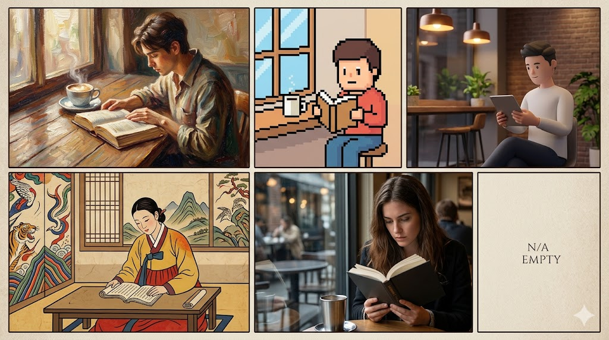

> 생성 가이드 — 동일 피사체(예: "카페에서 책 읽는 사람")를 유화풍, 픽셀 아트, 3D 렌더, 민화 스타일, 포토리얼 다섯 버전으로 만든 2×3 콜라주. Midjourney `--ar 16:9` 또는 Gemini Image로 생성 가능.

---

## 1부. 이미지 AI 이해하기

### 1.1 이미지 인식 vs 이미지 생성 — 두 방향의 AI

AI가 이미지를 다루는 방식은 크게 두 방향이 있다.

**이미지 인식(Recognition)** 은 이미지를 **읽어 들이는** 방향이다. 사진 속 얼굴을 찾고, 병변을 판별하고, CCTV에서 이상 행동을 감지한다. 우리가 카메라 앱에서 "인물 모드"를 쓰거나, 영수증을 찍어 경비처리하거나, 병원에서 CT를 판독하는 배경에는 모두 이미지 인식 AI가 있다.

**이미지 생성(Generation)** 은 반대 방향이다. 텍스트 설명이나 레퍼런스 이미지로부터 새로운 이미지를 **만들어낸다**. 이번 회차가 다루는 것이 바로 이 방향이다.

두 방향은 기술적으로 연결돼 있다. 좋은 생성 모델은 좋은 인식 능력 위에 서며, 최근의 서비스들은 두 능력을 하나의 인터페이스에 녹여낸다. Gemini에 사진 한 장을 올리고 "이 그림을 수채화 느낌으로 바꿔줘"라고 말하면, **인식(피사체·구도 파악) + 생성(새 이미지)** 이 동시에 일어난다.

> 지난 1회차 복습: LLM은 "다음 토큰을 확률적으로 예측"하는 모델이었다. 이미지 생성 모델은 "다음 **픽셀** 혹은 **노이즈 단계**를 예측"하는 방식으로 비슷한 원리를 이미지 영역으로 확장한 것이다.

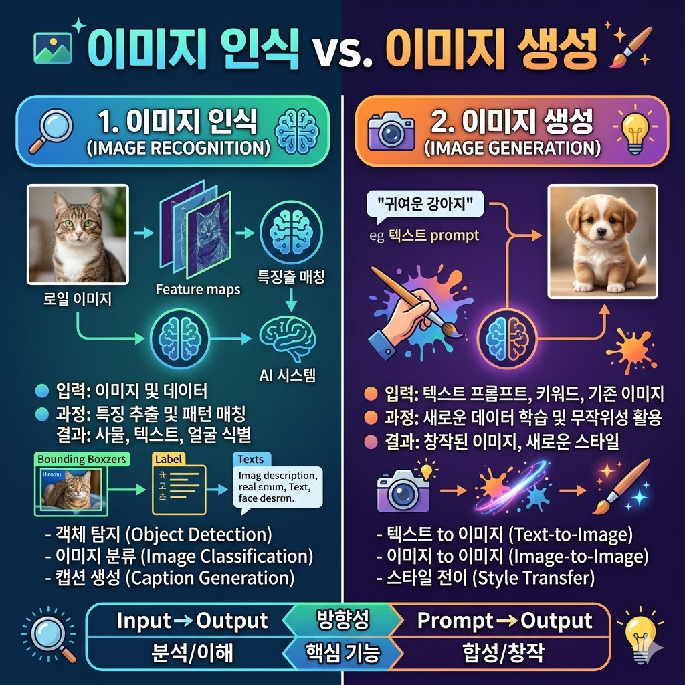

> 생성 가이드 — 왼쪽: 이미지 → 텍스트/라벨 화살표(인식). 오른쪽: 텍스트/스케치 → 이미지 화살표(생성). 중앙은 두 방향이 만나는 편집(inpainting) 영역. Mermaid flowchart 대체 가능.

---

### 1.2 이미지 생성 모델의 세 계보

이미지 생성 모델은 **GAN → Diffusion → AutoRegressive** 순으로 주류가 바뀌어 왔다. 뉴스에 "Stable Diffusion", "DALL·E", "Nano Banana" 같은 이름이 등장할 때, 이 중 어느 계보에 속하는지 알면 각 서비스의 성격이 한눈에 잡힌다.

#### GAN (Generative Adversarial Network, 적대적 생성 신경망)

2014년 Ian Goodfellow가 제안한 구조다. 두 개의 신경망을 **서로 싸우게** 만든다.

- **생성자(Generator)**: 진짜 같은 이미지를 만들어내려 한다.
- **판별자(Discriminator)**: 그게 진짜인지 가짜인지 판별하려 한다.

이 둘이 경쟁하다 보면 생성자는 점점 진짜에 가까운 이미지를 만들어낸다. "This Person Does Not Exist" 같은 사이트의 사실적인 얼굴 사진은 대부분 GAN 계열이다. 장점은 **빠르다**는 것. 한 번에 결과가 나온다. 단점은 **제어가 어렵다**는 것. "어떤 장면을 그려달라"고 말하기가 쉽지 않다.

현재 주류는 아니지만 특정 용도(얼굴 합성, 고해상도 재생성)에서 여전히 쓰인다.

#### Diffusion (확산 모델)

현재 이미지 생성의 **주류**. Stable Diffusion, DALL·E 2/3, Midjourney, Imagen 등 대부분이 이 계보다.

원리는 직관적이다. **노이즈 제거를 거꾸로 배운다.**

1. 학습 단계: 깨끗한 이미지에 조금씩 노이즈를 더해가며 "이 상태에서 어떤 노이즈가 추가됐는지"를 학습한다.
2. 생성 단계: 순수한 노이즈에서 출발해 학습한 내용을 **거꾸로** 적용. "이 노이즈를 조금 걷어내면 어떤 이미지일까?"를 20-50번 반복한다.

그 사이사이에 텍스트 프롬프트를 "조건"으로 넣어 "고양이 + 수채화 + 창가 햇살"이라는 방향으로 노이즈를 걷어낸다. 단계별로 점점 구체화되기 때문에 **중간에 개입(편집)하기 쉽다**. Inpainting(부분 수정), ControlNet(포즈 지정) 같은 강력한 도구들이 이 특성 덕에 가능하다.

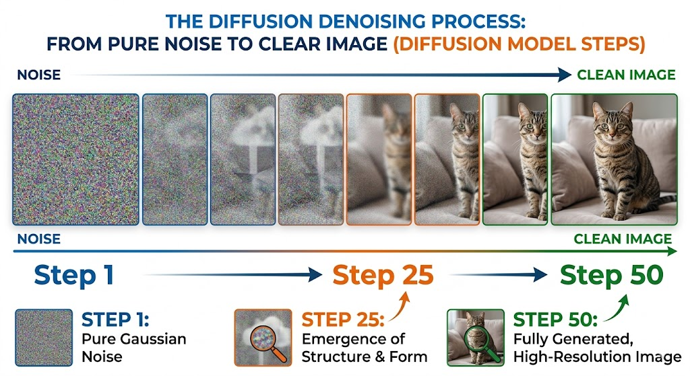

> 생성 가이드 — 왼쪽부터 오른쪽으로 5-8단계. 완전한 노이즈 → 희미한 형체 → 뚜렷한 이미지까지의 그라데이션. 각 단계에 "Step 1", "Step 25", "Step 50" 같은 레이블. Midjourney로 "diffusion denoising process, step by step, educational diagram" 등.

#### AutoRegressive (자기회귀 모델)

**텍스트를 생성하듯 이미지를 생성한다.** ChatGPT가 다음 단어를 예측하듯이, 이 모델은 이미지를 작은 조각(토큰)으로 나누고 "다음 토큰"을 예측해 이어 붙인다.

대표 서비스는 **OpenAI의 GPT Image**(ChatGPT 4o의 이미지 생성), **Google의 Gemini Image / Nano Banana**. 이들이 최근 주목받는 이유는:

- 텍스트 생성 모델과 **동일한 LLM 인프라** 위에 올릴 수 있어서, 대화 흐름 속에서 자연스럽게 이미지가 나온다.
- **텍스트 렌더링**(이미지 안에 글자 쓰기)이 Diffusion보다 정확하다. 로고·간판·인포그래픽에 강하다.
- 이전 대화 맥락을 이해한다. "방금 전 그린 고양이를 안경 씌워줘"가 자연스럽게 동작한다.

단점은 **속도가 느리고 자원을 많이 쓴다**는 것. 그리고 Diffusion만큼의 미세한 스타일 제어는 아직 약하다.

> 최근의 흐름은 이 세 계보가 융합되는 방향이다. Diffusion 모델 위에 AutoRegressive 방식의 프롬프트 이해 능력을 얹거나, 단계별 편집을 자연어 대화로 조작하는 식이다.

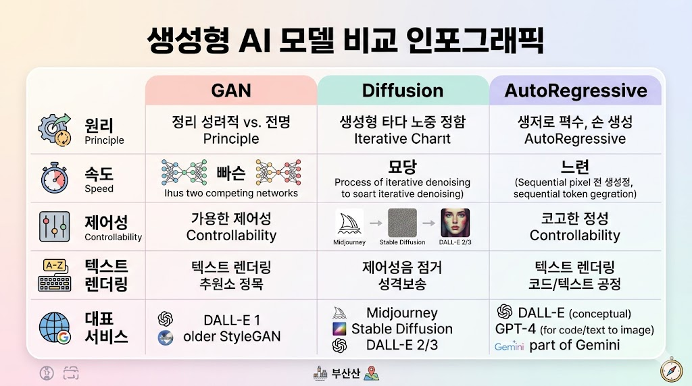

> 생성 가이드 — 3열 표 스타일 인포그래픽. 각 열: "GAN / Diffusion / AutoRegressive". 행: "원리 한 줄 / 속도 / 제어성 / 텍스트 렌더링 / 대표 서비스". 파스텔 톤.

---

### 1.3 세 계보의 특징 한눈에

| 기준 | GAN | Diffusion | AutoRegressive |
|---|---|---|---|
| **원리** | 생성자 ↔ 판별자 경쟁 | 노이즈 제거 역학습 | 다음 토큰 예측 |
| **속도** | 빠름 (한 번에) | 중간 (수십 스텝) | 느림 (토큰 하나씩) |
| **제어성** | 낮음 | **높음** (inpainting, ControlNet) | 중간 (대화로 보완) |
| **텍스트 렌더링** | 약함 | 개선 중 | **강함** |
| **대화 맥락** | 없음 | 낮음 | **높음** |
| **대표** | StyleGAN 계열 | SD, DALL·E 3, Midjourney, Imagen | GPT Image, Gemini Image, Nano Banana |

한 줄 요약: **"세밀한 제어는 Diffusion, 대화와 글자는 AutoRegressive."** 일반 사용자는 한 서비스를 고정해서 쓰기보다, 작업 성격에 따라 **섞어 쓰는 것**이 효율적이다.

---

## 2부. 서비스 지형 — 누가 무엇을 만드는가

### 2.1 주요 서비스 개관

이 시장은 **6개월 단위로 판이 뒤집힌다.** 2024년 중반까지 Midjourney가 "고품질의 대명사"였고, Stable Diffusion이 "오픈소스의 대표"였다. 2025년 들어 OpenAI GPT Image와 Google Nano Banana가 등장하면서 "대화형 이미지 편집" 영역에서 판도가 움직였다. 아래 지형은 2026년 초 기준이다.

#### OpenAI — DALL·E → GPT Image

- **DALL·E 2 (2022)**: Diffusion 기반. 처음으로 대중에게 "텍스트로 그리는 그림"을 각인시킴.
- **DALL·E 3 (2023)**: ChatGPT에 통합. 프롬프트를 모델이 알아서 다듬어줌.
- **GPT Image (2024)**: AutoRegressive 기반. ChatGPT 4o/5 안에서 대화형으로 이미지 생성·편집. 텍스트 렌더링과 일관성에서 도약.

오늘 실제로 쓰는 "ChatGPT의 이미지"는 GPT Image라고 보면 된다. 별도 제품이 아니라 ChatGPT 안에서 자연스럽게 나온다.

#### Google — Imagen → Gemini Image → Nano Banana

- **Imagen 2/3 (2023-2024)**: Google의 Diffusion 모델. 사실적 품질에서 강세.
- **Gemini Image (2024)**: Gemini 앱 안에서 이미지 생성.
- **Nano Banana (2025)**: Gemini 2.5 Flash Image의 별칭으로 화제. **빠른 속도 + 대화형 편집 + 일관성**에서 두각. 2025년 하반기 이미지 생성 트렌드의 핵심 키워드.

"Nano Banana"는 제품명이 아닌 내부 코드네임이 외부에서 굳어진 케이스다. 실제 접근은 Gemini 앱 또는 Google AI Studio를 통한다.

#### Stable Diffusion 계열

Stability AI가 공개한 오픈소스 Diffusion 모델. **모델 자체를 내 컴퓨터에 설치해서 돌릴 수 있다.**

- **Automatic1111 WebUI**: 가장 대중적인 로컬 UI.
- **ComfyUI**: 노드 기반. 파이프라인을 시각적으로 조립.
- **Civitai**: 커뮤니티가 만든 LoRA·체크포인트 공유 허브.

장점은 **완전한 통제와 프라이버시**. 데이터가 외부로 나가지 않고, 모델을 원하는 대로 미세 조정할 수 있다. 단점은 **GPU 필요 + 학습곡선이 가파름**. 일반 사용자에게는 "들어가볼 수 있지만 정주하기는 어려운" 영역.

#### Midjourney

**심미성의 대명사.** Diffusion 기반이지만 자체 학습·튜닝으로 "보기 좋은 그림"을 만드는 데 특화. 처음에는 Discord로만 쓸 수 있어 접근성이 낮았으나 2024년 웹 인터페이스 공개로 대중화.

강점: 스타일의 일관성, 구도, 조명. **포스터·일러스트·컨셉 아트**에서 1순위로 꼽힌다. 약점: 대화형 편집은 약함, 구독 요금제 외 정책이 제한적.

#### Seedream (ByteDance)

TikTok 모회사 ByteDance의 이미지 모델. 2025년 급부상. 중국어권 스타일, 캐릭터 일관성, 인물 편집에서 특히 강점. 국내에서는 아직 직접 서비스 접근이 제한적이나, 일부 앱(CapCut 등)을 통해 간접 사용 가능.

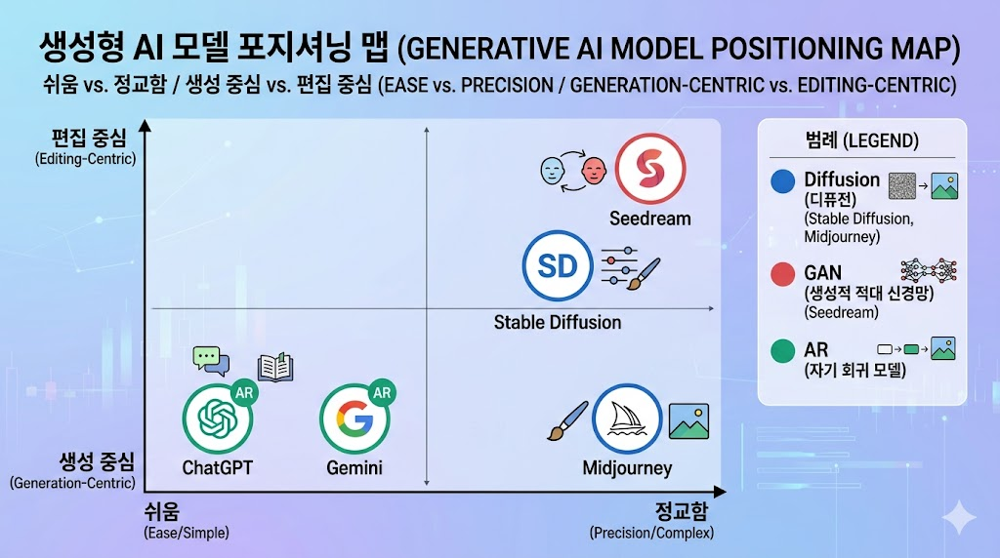

> 생성 가이드 — 2축 포지셔닝 맵. X축: "쉬움 ↔ 정교함", Y축: "생성 중심 ↔ 편집 중심". 각 서비스 로고 배치(DALL·E/GPT Image, Imagen/Nano Banana, SD, Midjourney, Seedream). 범례에 계보(GAN/Diffusion/AR) 색상 구분.

---

### 2.2 서비스 비교표 — 무엇을 기준으로 고를까

표준화된 지표가 없으므로 아래는 **일반 사용자의 체감** 기준 개관이다.

| 항목 | ChatGPT(GPT Image) | Gemini(Nano Banana) | Midjourney | Stable Diffusion(로컬) | Seedream |
|---|---|---|---|---|---|
| **접근성** | 쉬움 (ChatGPT 안) | 쉬움 (Gemini 앱) | 쉬움 (웹·Discord) | 어려움 (설치) | 보통 (앱 경유) |
| **품질(심미)** | 상 | 상 | **최상** | 모델에 따라 ★ | 상 |
| **품질(사실감)** | 상 | **최상** | 상 | 상 | 상 |
| **텍스트 렌더링** | **최상** | 최상 | 중 | 중 | 상 |
| **한국어 프롬프트** | 잘 통함 | **잘 통함** | 통하지만 영어가 나음 | 모델마다 | 잘 통함 |
| **편집(inpainting)** | 상 (대화형) | **최상** (대화형) | 중 | **최상** (로컬 도구) | 상 |
| **일관성(시리즈)** | 상 | **최상** | 상 | **최상**(LoRA) | 상 |
| **가격 구조** | ChatGPT 구독 | 무료 티어 큼 + 구독 | 전용 구독 | 전기세·GPU | 앱마다 |
| **상업 이용** | 가능(약관 확인) | 가능(약관 확인) | 플랜에 따라 | 모델 라이선스 확인 | 약관 확인 |

> 실전 조언: **주력 1개 + 보조 1-2개**. 대부분의 일반 사용자는 Gemini(또는 ChatGPT)를 주력으로, 포스터·일러스트 필요 시 Midjourney를 추가하는 조합이 효율적이다.

---

### 2.3 구독과 비용 — 크레딧인가 구독인가

이미지 AI의 요금 구조는 **"크레딧(사용량)" 모델과 "구독(시간·용량)" 모델** 두 가지로 나뉜다. 여기에 **무료 티어**가 더해진다.

#### 크레딧 모델

한 장 생성마다 크레딧을 차감. Midjourney의 "Fast GPU 시간", DALL·E의 개별 이용이 이에 해당. 가끔 쓰는 사람에게 유리하지만, **작업이 많아지면 순식간에 비용이 뛴다.**

#### 구독 모델

월 정액. ChatGPT Plus(월 $20), Gemini Advanced(월 ₩29,000 수준)에 이미지 생성이 포함. "많이 쓰면 이득, 적게 쓰면 손해".

#### 무료 티어

- **Gemini**: 일일 무료 생성 횟수가 상대적으로 넉넉. 2025-2026년 기준 Nano Banana 포함.
- **ChatGPT**: 무료 사용자도 일부 이미지 생성 가능(횟수·해상도 제한).
- **Bing Image Creator / Copilot**: DALL·E 3 무료 사용 가능 (크레딧 충전 방식).

#### 선택 가이드 (일반 사용자 기준)

| 월 사용 예상 | 추천 조합 |
|---|---|
| **가끔 (월 10장 미만)** | Gemini 무료 + Bing Copilot 무료 |
| **자주 (월 50장 내외)** | Gemini Advanced **또는** ChatGPT Plus |
| **업무 집중 (월 200장+)** | Gemini Advanced + Midjourney Basic($10) |
| **전문가·일관성 작업** | Midjourney Standard+ + 로컬 Stable Diffusion |

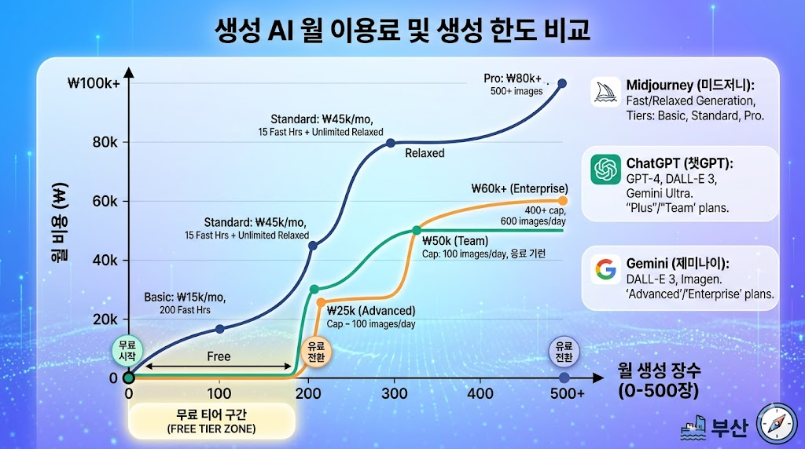

> 생성 가이드 — X축: 월 생성 장수(0-500). Y축: 월 비용(₩). 3-4개 서비스의 요금 곡선을 겹쳐 그린 라인 차트. 무료 티어 구간은 별도 하이라이트.

> **비용 관리 팁**: 구독은 **필요할 때만** 월 단위로 결제하고 필요 없는 달은 해지. 연간 할인은 정말 매일 쓸 때만 선택.

---

### 2.4 Nano Banana 자세히

"나노 바나나"는 Google이 Gemini 2.5 Flash Image 모델을 내부에서 부르던 코드네임이 외부에 알려지면서 고유명사가 됐다. 2025년 하반기부터 이미지 편집·합성 분야에서 가장 주목받는 키워드.

**특징**

- **속도**: 동일 프롬프트 기준 DALL·E 3나 Midjourney보다 빠르게 결과를 낸다.
- **대화형 편집**: "아까 그 고양이를 의자에 앉혀줘", "배경만 해변으로 바꿔줘"가 자연스럽게 동작. 매번 새 이미지를 그리는 것이 아니라 맥락을 이어간다.
- **일관성**: 같은 인물·캐릭터를 여러 장면에 반복 등장시켜도 얼굴·스타일이 유지된다. **캐릭터 시트, 시리즈 일러스트, 브랜드 마스코트** 작업에 탁월.
- **합성**: 레퍼런스 이미지 2-3장을 주고 "이 인물 + 이 배경 + 이 의상"을 조합하는 식의 합성이 강력.

**한계**

- 미세한 아트 스타일(특정 화가 풍)은 Midjourney가 여전히 우세.
- 초고해상도 출력은 SD/Midjourney 대비 아직 제약.
- 2026년 초 기준 국가별 정책이 바뀔 수 있어 사용 전 지역 제한 확인 필요.

**접근 경로**

1. **Gemini 앱** (가장 쉬움) — 무료 또는 Advanced.
2. **Google AI Studio** — 프롬프트 튜닝·API 시험.
3. **Vertex AI** — 기업용, API로 대량 호출.

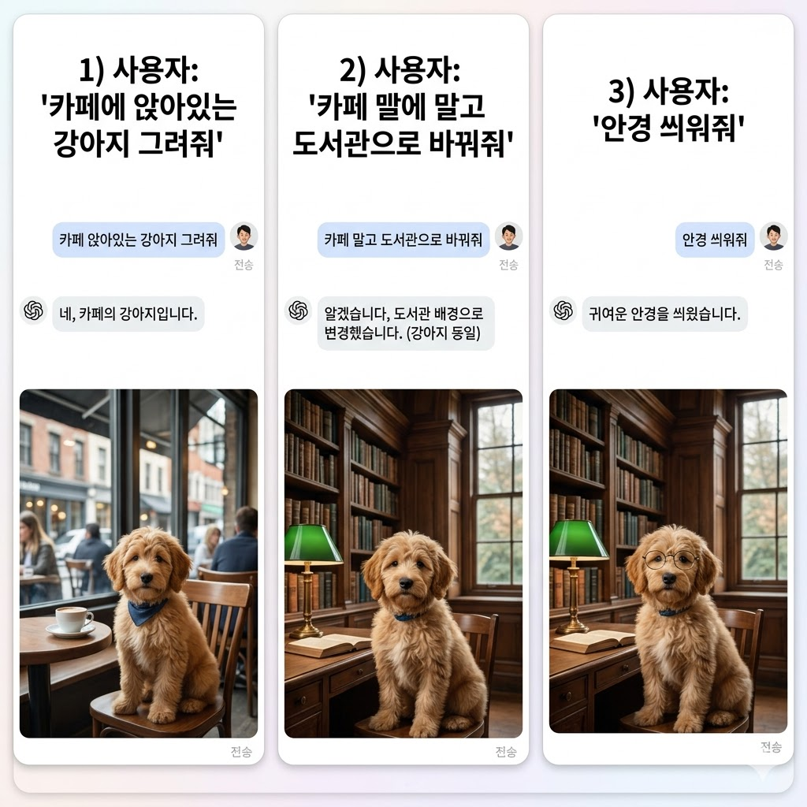

> 생성 가이드 — 채팅 인터페이스 목업. 1) 사용자: "카페에 앉아있는 강아지 그려줘" → AI 이미지. 2) 사용자: "카페 말고 도서관으로 바꿔줘" → 동일 강아지, 배경만 변경. 3) 사용자: "안경 씌워줘" → 안경 추가. 세 단계 스크린샷 콜라주.

---

## 3부. 반드시 알아야 할 주의사항

이미지 생성은 편리하지만, **텍스트와 달리 이미지는 진위가 쉽게 뒤바뀌는 매체**다. 실용 전에 짚어두어야 할 네 가지.

### 3.1 프라이버시 — 내가 올린 사진은 어디로 가는가

클라우드형 이미지 서비스(ChatGPT·Gemini·Midjourney)에 **내 사진이나 가족 사진을 올리면**, 그 사진은:

- 서버에 저장되며, 일정 기간 로그가 남는다.
- 약관에 따라 **모델 학습에 사용될 수 있다**(서비스별·플랜별로 다름).
- 일부 서비스는 오용 감지를 위해 사람이 검토할 수 있다.

실무 원칙:

1. **민감한 이미지는 올리지 않는다.** 증명사진, 의료 영상, 자녀 얼굴, 기밀 서류.
2. 업로드 전에 **학습 사용 opt-out** 설정을 확인한다(ChatGPT·Gemini 모두 제공).
3. 강한 프라이버시 요구 시 **로컬 Stable Diffusion**을 고려한다.

> "AI가 내 얼굴로 학습했다"는 우려는 과장되기도 하지만, 실제로 존재하는 위험이다. 올리기 전에 "이 사진이 외부에 공유돼도 괜찮은가"를 한 번 더 생각하는 습관이 중요하다.

### 3.2 공식 앱·공식 경로만 사용

AI 열풍을 틈타 **가짜 앱, 가짜 익스텐션**이 늘고 있다.

- 앱스토어에서 "ChatGPT", "Gemini", "Midjourney"를 검색하면 유사 앱이 여럿 나온다.
- 정품처럼 보이는 크롬 익스텐션이 로그인 쿠키를 훔친다.
- "무제한 Nano Banana"를 내세운 3rd-party 앱이 결제 정보만 챙기고 사라진다.

확인 방법:

- **ChatGPT**: OpenAI, Inc. 개발자. 앱 이름은 정확히 "ChatGPT".
- **Gemini**: Google LLC. "Google Gemini".
- **Midjourney**: midjourney.com 웹 접속. 모바일 앱은 최근 공식 출시됨 (개발자: Midjourney Inc.).
- 의심되면 **제조사 공식 웹사이트 → 앱스토어 링크**를 따라간다.

### 3.3 진위 여부 — 딥페이크와 오인

AI 이미지는 이제 전문가도 직관으로 구별하기 어렵다. 뉴스·SNS에서 본 이미지가 AI 생성일 가능성을 항상 열어둬야 한다.

**식별 단서** (2026년 현재 기준, 빠르게 무의미해지는 중):

- 손가락 개수·관절 방향 (점점 완벽해짐).
- 글자가 희미하게 뭉개지거나 의미 없는 문자열.
- 배경 건축물의 비대칭, 반복 패턴의 어긋남.
- 눈동자 반사광·모공의 미세 패턴.

사용자 원칙:

- **중요한 판단이 필요한 이미지**(뉴스 사진, 계약 근거 등)는 원출처를 확인한다.
- 내가 AI로 만든 이미지를 공유할 때는 **"AI 생성"임을 명시**하는 것이 장기적으로 신뢰를 쌓는 길이다.

### 3.4 워터마크 — SynthID · C2PA · 비밀도장

AI 이미지 식별을 위한 **표준 워터마크**가 자리 잡고 있다.

**SynthID (Google)**

- Gemini / Imagen / Nano Banana로 생성된 이미지에 **눈에 보이지 않는 워터마크**가 새겨진다.
- 이미지를 자르거나 압축해도 상당 부분 보존된다.
- Google이 제공하는 검증 도구로 "AI로 만든 것인지"를 확인 가능.

**C2PA (Content Credentials, 콘텐츠 자격증명)**

- Adobe·Microsoft·OpenAI가 주도하는 업계 표준.
- 이미지에 "누가·언제·어떻게 만들었는지"의 메타데이터(서명 포함)가 붙는다.
- contentcredentials.org에서 드래그&드롭으로 확인.

**국내의 "비밀도장" 논의**

정부·언론이 "AI 생성 이미지 표시 의무화"를 논의 중. 2026년 기준 일부 매체는 이미 "AI 사용" 레이블을 의무 부착. 앞으로 더 강화될 가능성이 높다.

**사용자의 체크 습관**

1. 이미지 저장 시 워터마크(SynthID 등)가 포함되는지 서비스 설명 확인.
2. 내가 쓸 이미지가 **상업용**이라면, 생성 서비스의 약관과 워터마크 정책을 반드시 읽는다.
3. 의심되는 이미지는 Content Credentials 검증 사이트에 업로드.

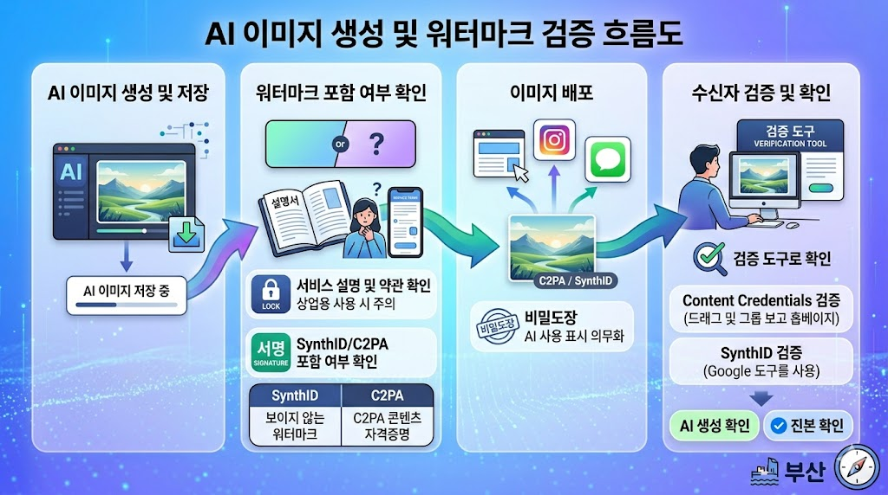

> 생성 가이드 — 좌→우 흐름도. "AI 이미지 저장 → SynthID/C2PA 포함 여부 → 배포 → 수신자가 검증 도구로 확인". 아이콘: 잠금, 서명, 검증 체크.

---

## 4부. 들어가보기 — 두 서비스 한번 훑어보기

강의에서는 실제 화면을 띄워 **Midjourney**와 **Leonardo.ai**를 1인칭 시점으로 훑어본다. 이 절은 강의 참고용 개관이다.

### 4.1 Midjourney — 포스터·일러스트의 표준

- **접속**: midjourney.com → Google 로그인.
- **첫 화면**: 커뮤니티 피드(전 세계 사용자들의 생성물). 스타일 감 잡기에 좋다.
- **생성**: 상단 프롬프트 바. `/imagine` 명령 없이 텍스트만 입력.
- **파라미터**: 프롬프트 끝에 `--ar 16:9`(비율), `--v 6`(버전), `--stylize 500`(양식화 강도) 등.
- **요금**: 월 $10(Basic) / $30(Standard) / $60(Pro).

**볼거리 3가지**

1. **Explore 탭** — 트렌드 파악. 프롬프트가 공개돼 있어 학습용.
2. **Variations & Upscale** — 마음에 드는 출력의 변형·고해상도화.
3. **Remix 모드** — 재생성 시 일부 프롬프트만 교체.

### 4.2 Leonardo.ai — 무료로 시작하는 Diffusion 허브

- **접속**: leonardo.ai → 이메일 또는 구글 가입.
- **일일 무료 토큰** 제공 (하루 150 토큰 내외).
- **모델 선택 가능**: 사진풍, 애니메이션풍, 게임 아트풍 등 수십 종 체크포인트.
- **Canvas**: 인페인팅·아웃페인팅을 시각적으로 수행.

**특징**

- UI가 자세하고, 각 파라미터가 노출돼 있어 **"왜 이런 결과가 나왔는지"를 학습**하기 좋다.
- Stable Diffusion 로컬 설치 전 단계에서 연습하기 좋은 중간 지점.

> 강의에서는 화면만 보여주고 끝. 실제 작업은 이후 5부에서 Gemini·ChatGPT로 한다.

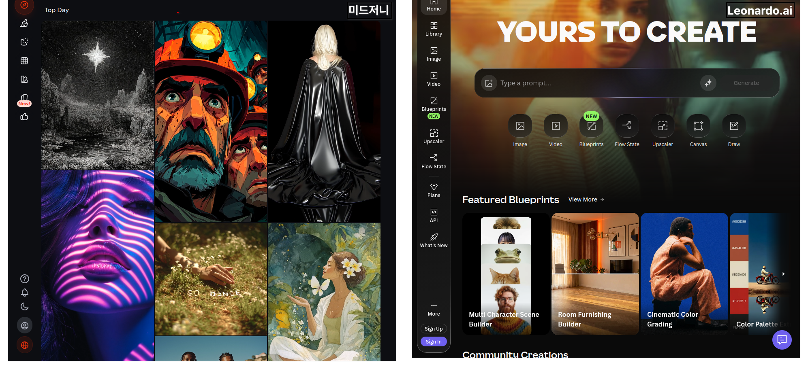

> 생성 가이드 — 좌우 2분할 스크린샷 콜라주. 왼쪽: Midjourney 웹 (피드 + 프롬프트 바). 오른쪽: Leonardo.ai 생성 화면 (모델 선택 · 파라미터 슬라이더).

---

## 5부. 직접 사용해보기 — Gemini / ChatGPT

이번 강의의 중심 실습은 **Gemini**와 **ChatGPT** 두 서비스. 이유는 두 가지다. (1) 1회차에서 이미 계정과 기본 사용법을 익혔다. (2) 대화형 편집이 강해 **"한 번 그리고 끝"이 아닌 반복 개선**이 쉽다.

### 5.1 기본 이미지 생성

**Gemini**: 입력창 좌측의 이미지 생성 버튼을 누르지 않아도, "~을 그려줘"라고 쓰면 자동으로 이미지 생성 모드로 들어간다.

```
한옥 마당에서 매화가 핀 봄날, 수묵화 스타일로 그려줘.
```

**ChatGPT**: GPT-4o 이상 모델에서 같은 방식. 한국어도 잘 이해하지만, **세밀한 스타일 지정**은 영어 키워드가 조금 더 정확한 경우가 있다.

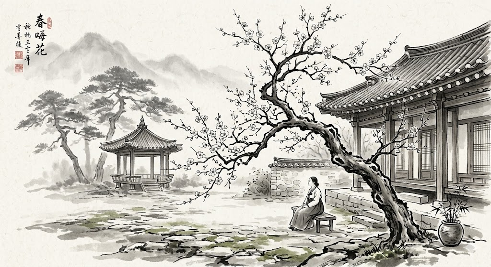

> 생성 가이드 — 동일 프롬프트를 Gemini와 ChatGPT에서 돌린 결과 좌우 비교. 캡션: "같은 프롬프트도 모델마다 해석이 다르다."

### 5.2 비율·해상도 변경

서비스마다 프롬프트에 직접 비율을 넣는 방법이 다르다.

- **Gemini**: `가로 세로 비율은 16:9로 해줘` (자연어).
- **ChatGPT**: `Make it a 16:9 widescreen image` (영어가 잘 통함) 또는 한국어로 `가로로 긴 이미지로`.
- **Midjourney**: `--ar 16:9`.

해상도는 보통 서비스가 관리한다. "고해상도로 다시" 같은 후속 요청으로 업스케일.

### 5.3 편집 기능 — inpainting, outpainting, 부분 수정

**inpainting** 은 "이 부분만 바꿔줘". **outpainting**은 "이 이미지의 바깥을 확장해줘".

**Gemini 대화형 편집 (강점)**

```
방금 그린 이미지에서, 사람의 옷 색깔만 빨간색으로 바꿔줘.
```

**ChatGPT**: 이미지를 클릭 → 일부를 선택(마스크) → 새 지시.

**로컬 도구(SD)**: Automatic1111의 Inpaint 탭, ComfyUI의 Inpaint 노드.

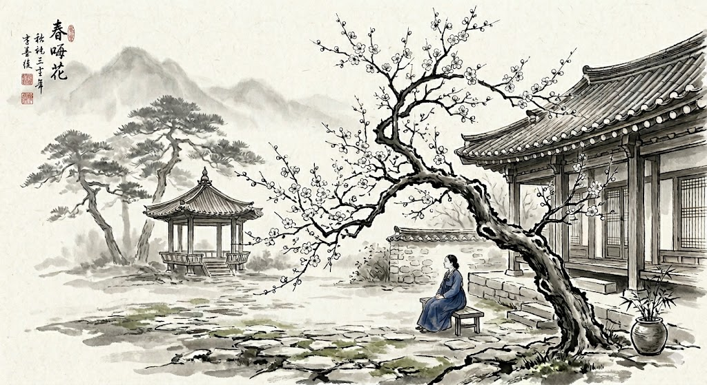
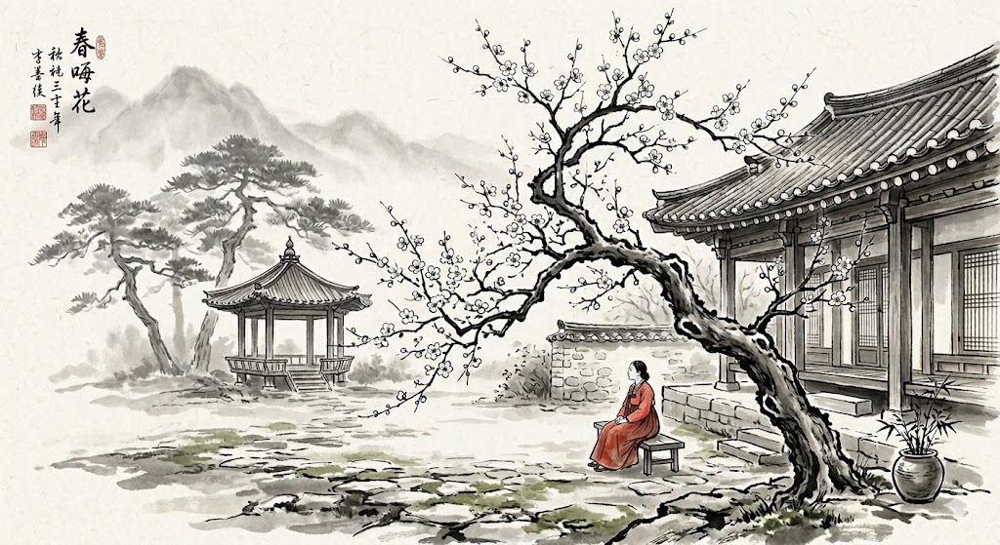

> 생성 가이드 — before: 파란 옷의 인물. after: 같은 인물·포즈, 빨간 옷. 두 장 나란히 배치해서 "핵심은 유지, 특정 부분만 변경" 강조.

### 5.4 좋은 프롬프트의 구성 요소

이미지 프롬프트는 대략 여섯 덩어리로 분해된다. 한 번에 모든 칸을 채울 필요는 없지만, **결과가 아쉬울 때 어느 칸이 비어 있었는지 점검**하는 틀로 쓸 수 있다.

| 구성 요소 | 예시 키워드 | 역할 |
|---|---|---|
| **주제 (Subject)** | "노인 부부가 공원 벤치에 앉아있다" | 무엇을 그릴지 |
| **스타일 (Style)** | "수채화, 유화, 3D 렌더, 픽셀아트, 민화" | 어떤 화풍으로 |
| **조명 (Lighting)** | "황금 시간대, 역광, 스튜디오 조명, 은은한 창가" | 분위기의 절반 |
| **구도 (Composition)** | "클로즈업, 와이드 샷, 오버 더 숄더, 아이소메트릭" | 보는 각도 |
| **배경 (Setting)** | "한적한 시골 골목, 90년대 아파트, 우주 정거장" | 맥락 |
| **제외 (Negative)** | "글자 없이, 흐림 없이, 사람 없이" | 피할 것 |

**조합 예시**

```
[주제] 한옥 마루에 앉아 차를 마시는 중년 남자 한 명.
[스타일] 유화. 두꺼운 붓 터치가 살아있는 서양 고전 유화 스타일.
[조명] 초여름 저녁의 부드러운 측광. 따뜻한 색감.
[구도] 중간 거리, 살짝 위에서 내려다보는 각도.
[배경] 정원의 단풍나무가 흐릿하게 보임.
[제외] 사진처럼 선명한 디테일 말고, 붓 자국이 남도록.
```

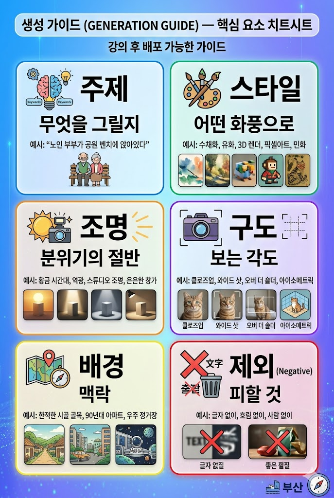

> 생성 가이드 — 2×3 그리드 포스터. 각 셀: 아이콘 + 요소 이름 + 한 줄 설명. 요소별 색상 구분. 강의 후 배포 가능한 "치트시트" 형태.

### 5.5 이미지 → 프롬프트 역추출

**가진 이미지의 스타일을 알고 싶을 때** AI에게 분석시킨다.

```
이 이미지의 스타일·조명·구도·색감을 프롬프트 6요소로 분해해줘.
내가 이 스타일로 다른 장면을 그리고 싶다.
```

Gemini, ChatGPT 둘 다 잘한다. 더 정교하게 하고 싶으면:

```
위 분석을 바탕으로 "비오는 날 지하철 플랫폼" 장면의 프롬프트를 작성해줘.
```

**응용**: Pinterest나 SNS에서 마음에 드는 이미지를 캡처 → 분석 요청 → 나만의 프롬프트로 재가공.

---

## 6부. 14가지 이미지 생성 기법 (실전 레시피)

본 섹션은 **레시피북** 형식이다. 각 기법마다:

- **언제 쓰나**
- **핵심 프롬프트 패턴**
- **Before / After 예시 자리**
- **실전 팁**

강의에서는 이 중 6-8개를 화면에서 시연하고, 나머지는 자료로 남긴다.

### 6.1 일관된 캐릭터 유지

**언제 쓰나** — 같은 인물·캐릭터가 여러 장면에 등장해야 할 때 (시리즈 일러스트, 교보재, 스토리북).

**핵심 패턴** — 첫 이미지에서 외모를 구체적으로 고정한 뒤, **동일 대화 맥락**에서 "같은 인물을 ..." 문구로 이어간다. Nano Banana와 GPT Image가 강함.

```
1) 40대 남자, 짧은 검은 머리, 안경 없음, 체크 셔츠, 웃는 표정.
   카페에서 노트북을 보는 장면. 수채화 스타일.

2) [다음 턴] 같은 남자가 서점에서 책을 고르는 장면, 동일 스타일 유지.

3) 같은 남자가 공원에서 강아지와 산책하는 장면.
```

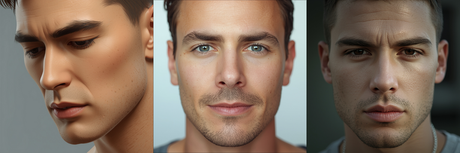
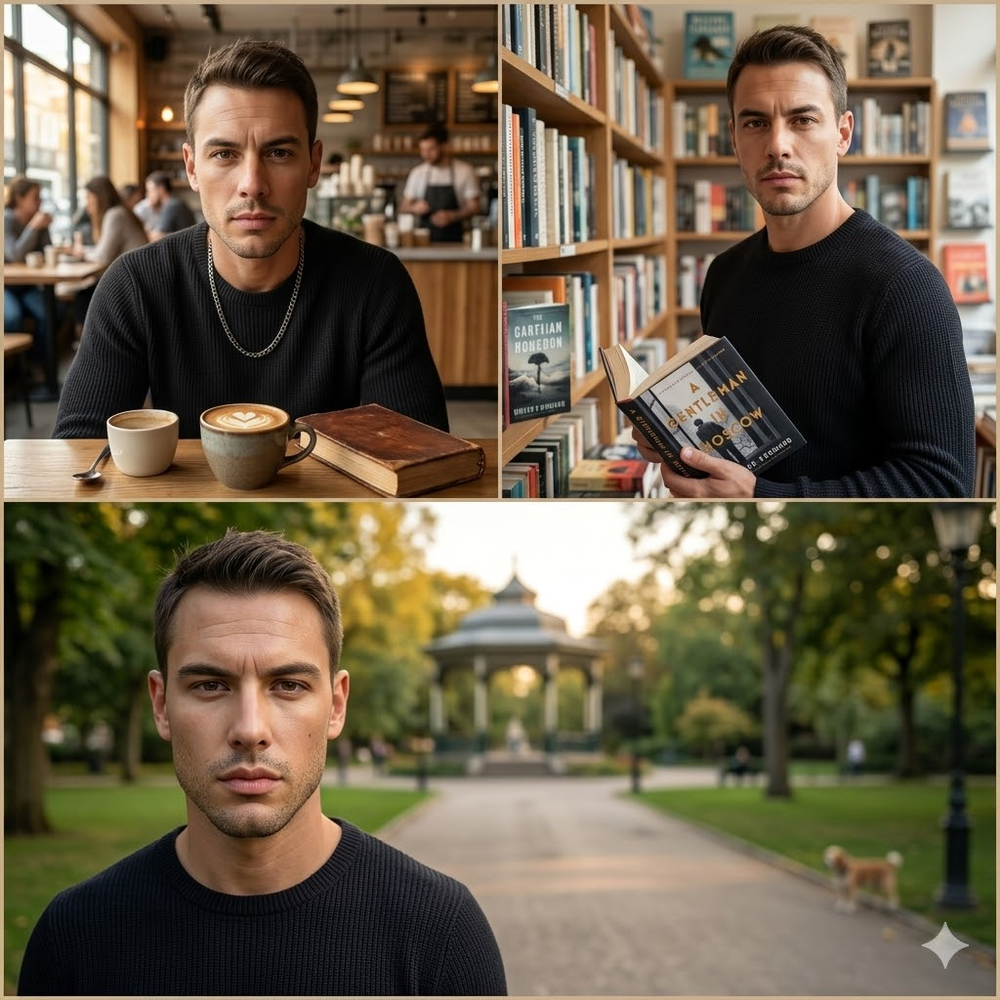

> before: 흩어진 3장의 일관성 없는 인물. after: 같은 인물, 다른 장면 3장. 캐릭터 일관성 체감용.

**팁** — 인물 외모 키워드를 **세 번째 줄까지** 구체화. "남자"로 끝내면 매번 다른 얼굴이 나온다.

---

### 6.2 제품과 배경 합성

**언제 쓰나** — 쇼핑몰·SNS 제품 사진을 찍지 않고 AI로 만들 때.

**핵심 패턴** — 제품 이미지 업로드 → "이 제품을 ~한 배경에 자연스럽게 놓아줘".

```
[첨부: 흰 머그컵 실물 사진]
이 머그컵을 초여름 오후, 발코니의 나무 테이블 위에 놓고
옆에는 펼쳐진 책 한 권과 작은 선인장이 있는 장면으로 합성해줘.
자연광, 살짝 위에서 내려다보는 구도, 따뜻한 색감.
```


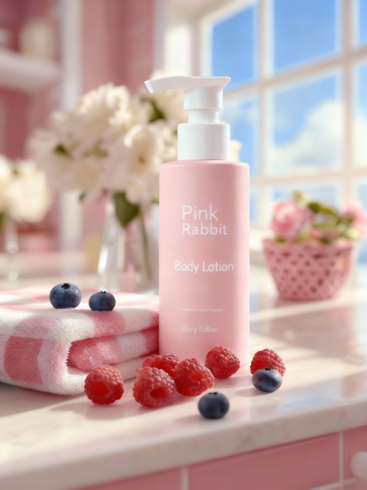

> before: 흰 배경의 제품 샷. after: 자연스러운 라이프스타일 배경 속의 동일 제품.

**팁** — 제품의 반사·그림자 방향을 말로 지정하면 합성 티가 덜 난다("자연광이 왼쪽 위에서 들어와 오른쪽에 짧은 그림자").

---

### 6.3 음식에 소품 추가

**언제 쓰나** — 음식점 메뉴판·배달앱 썸네일을 풍성하게.

**핵심 패턴**:

```
[첨부: 그릇에 담긴 비빔밥 사진]
이 비빔밥 주변에 소박한 반찬 3가지(김치, 나물, 계란말이)를
짙은 나무 쟁반 위에 얹고, 놋수저를 옆에 두어줘.
전통 한식당 분위기의 조명과 구도로.
```


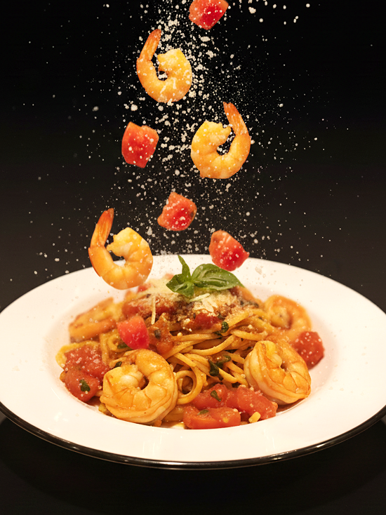

**팁** — "그림자 방향을 통일"을 덧붙이면 합성이 훨씬 자연스럽다.

---

### 6.4 로고·간판 생성

**언제 쓰나** — 가게 간판, SNS 프로필, 뉴스레터 헤더.

**핵심 패턴** — 텍스트 렌더링에 강한 **GPT Image·Nano Banana** 사용. 글자가 중요하므로 명시적으로 포함.

```
가게 이름 "한디커피"의 로고를 만들어줘.
- 글자: "한디커피" (한글)
- 느낌: 따뜻함, 수공예, 자연
- 스타일: 손으로 쓴 듯한 서체 + 커피잔과 나뭇잎 아이콘
- 배경: 투명 또는 크림색
- 비율: 정사각형
```


> 생성 가이드 — 2×2 그리드. 동일 브랜드명을 네 가지 스타일(미니멀·빈티지·모던·핸드드로잉)로.

**팁** — 로고는 **3-4개 변형 요청** 후 고르는 것이 한 번에 완벽을 바라는 것보다 효율적.

---

### 6.5 상품과 모델 합치기 — 모델 컷

**언제 쓰나** — 의류·액세서리·화장품의 "모델이 착용한" 사진.

**핵심 패턴** — 제품 사진 + 모델 레퍼런스(또는 프롬프트)를 함께 주고 합성.

```
[첨부 1: 티셔츠 제품 사진]
[첨부 2: 모델 스타일 레퍼런스 — 30대 여성, 자연스러운 포즈]
이 티셔츠를 레퍼런스의 모델이 자연스럽게 착용한 장면.
장소는 도심 골목. 부드러운 오후 햇살. 세미 측면 반신샷.
```


**팁** — 의류는 **주름·광택**을 지시(예: "자연스러운 면 소재 주름")해야 마네킹 느낌을 피한다.

---

### 6.6 스케치 → 3D 렌더링

**언제 쓰나** — 디자인 초안(손 그림)을 그럴듯한 결과물로 시각화.

**핵심 패턴** — Gemini에 스케치 업로드 + "이 디자인을 3D 렌더링으로".

```
[첨부: 연필 스케치]
이 스케치의 의자 디자인을 실제 제작된 듯한 3D 렌더링으로 만들어줘.
- 재질: 원목(오크) + 검은 가죽 쿠션
- 조명: 스튜디오 라이팅
- 배경: 단색 밝은 회색
- 구도: 45도 각도, 전신이 보이게
```


**팁** — 재질 키워드를 **두 개 이상** 지정하면 현실감이 확 올라간다("오크 원목 + 검은 가죽").

---

### 6.7 CAD 건축도면 생성

**언제 쓰나** — 초기 컨셉 단계, 실사 3D 모델 만들기 전의 아이디어 스케치.

**핵심 패턴**:

```
30평형 아파트 평면도를 CAD 스타일 선으로 그려줘.
- 방 3개 + 거실 + 주방 + 욕실 2
- 현관은 남쪽
- 각 방에 치수 기입 (mm)
- 창문은 이중선으로 표시
```


**팁** — 정확한 **치수**가 필요한 경우에는 AI 출력을 **초안**으로만 쓰고, 실제 설계는 AutoCAD·SketchUp 등 전용 도구에서 마무리한다. AI는 **아이디어 발산**까지가 최적 용도.

---

### 6.8 평면도 → 3D 아이소메트릭

**언제 쓰나** — 부동산 매물, 인테리어 시안, 공간 설명.

**핵심 패턴**:

```
[첨부: 2D 평면도]
이 평면도를 가구가 배치된 3D 아이소메트릭 뷰로 바꿔줘.
- 벽 높이 2.4m (비례로)
- 천장은 없이 내부가 다 보이게
- 따뜻한 조명, 파스텔 컬러 팔레트
```


**팁** — 파스텔 팔레트를 지정하면 **도면의 기능**과 **인테리어의 감각**이 함께 살아난다.

---

### 6.9 인물 → 만화 캐릭터

**언제 쓰나** — 프로필 이미지, SNS 아바타, 가족 선물.

**핵심 패턴**:

```
[첨부: 내 얼굴 정면 사진]
이 사람을 픽사 애니메이션 스타일의 캐릭터로 바꿔줘.
특징(안경·미소·머리 색)은 유지하고,
배경은 단순한 파스텔 블루로.
```


**팁** — **스타일 키워드를 정확히** ("픽사 스타일", "지브리 스타일", "1990년대 디즈니 스타일"). 모호한 "만화풍"은 결과가 들쭉날쭉하다.

---

### 6.10 캐릭터 시트 만들기

**언제 쓰나** — 동화책, 브랜드 마스코트, 유튜브 캐릭터.

**핵심 패턴**:

```
다음 캐릭터를 캐릭터 시트로 만들어줘.
캐릭터: 10살 소녀, 빨간 단발머리, 노란 멜빵바지, 초록 운동화, 주근깨.
구성: 정면 / 옆모습 / 뒷모습 / 기쁨 / 슬픔 / 놀람 표정 6컷.
배경: 흰색. 각 컷에 작은 레이블.
```


**팁** — 한 번에 6컷을 시도하기보다, 먼저 **정면 1컷**으로 디자인을 확정한 뒤 "같은 캐릭터로 측면을..." 식으로 이어가면 일관성이 높아진다.

---

### 6.11 픽셀 아트 변환

**언제 쓰나** — 레트로 게임, 아이콘, 짤방.

**핵심 패턴**:

```
[첨부: 인물 사진 또는 풍경 사진]
이 사진을 16비트 시절 RPG 게임 스타일 픽셀 아트로 변환해줘.
해상도: 64×64 느낌으로, 제한된 팔레트(16색).
```


**팁** — 팔레트를 제한(`16색`, `8색`)하라고 지시하면 진짜 레트로 감성이 나온다.

---

### 6.12 민화 스타일 만들기

**언제 쓰나** — 한국적 정서의 콘텐츠, 전시·교육 자료.

**핵심 패턴**:

```
조선 민화 까치호랑이 스타일로 다음 장면을 그려줘.
장면: 소나무 아래 고양이 두 마리.
특징: 평면적 구도, 굵고 명료한 선, 진채(주황·남색·연두)의 대비,
한자 대신 한글 풍의 그림 문자 여백.
```


**팁** — "조선 민화", "까치호랑이", "진채"처럼 **문화 특정 키워드**가 들어가야 결과가 살아난다. 단순히 "한국 전통 스타일"은 범위가 넓어 평범해진다.

---

### 6.13 오래된 사진 복원

**언제 쓰나** — 가족 앨범, 유품, 기념사진.

**핵심 패턴**:

```
[첨부: 1970년대 흑백 사진, 훼손된 부분 있음]
이 사진을 복원해줘.
- 긁힘·접힘 자국 제거
- 인물의 얼굴 디테일은 그대로 유지
- 자연스러운 컬러로 채색 (지나치게 화려하지 않게)
- 원본의 빛바랜 느낌은 살짝 남기기
```


**팁** — "지나치게 또렷하지 않게", "원본의 질감 유지"를 꼭 넣는다. 과도하게 선명해지면 **다른 얼굴**이 될 수 있다. 복원은 보수적으로.

> ⚠️ 가족 사진을 클라우드에 올리기 전 **3.1 프라이버시** 원칙 재확인.

---

### 6.14 인포그래픽 만들기

**언제 쓰나** — 교육 자료, 보고서, SNS 콘텐츠.

**핵심 패턴** — 텍스트 렌더링이 강한 **GPT Image·Nano Banana** 사용.

```
"건강한 하루 루틴" 인포그래픽을 만들어줘.
레이아웃: 세로형, 6단계(기상·스트레칭·아침식사·걷기·물 2L·취침).
각 단계에 한글 레이블 + 아이콘.
색상: 파스텔 톤, 통일된 팔레트.
하단에 "© 한디카페" 작게.
```


**팁** — 한글 텍스트 렌더링 시 **짧고 정확한 문구**를 넘긴다. 긴 문장은 글자가 깨지기 쉽다.

---

## 7부. 정리와 다음 단계

### 오늘의 3가지 Takeaway

1. **세 계보를 기억하라** — GAN / Diffusion / AutoRegressive. 어느 계보인지를 알면 서비스의 성격이 보인다.
2. **주력 1 + 보조 1** — 한 서비스에 묶이지 말고, 작업 성격에 따라 바꿔 쓰는 습관을 들인다.
3. **프롬프트는 6요소** — 주제·스타일·조명·구도·배경·제외. 결과가 아쉬울 때 점검표로 쓴다.

### 다음 회차 예고

| 회차 | 날짜 | 주제 |
|---|---|---|
| 3회차 | 4/27(월) | AI를 활용한 나만의 음악 및 음원 작곡하기 |
| 4회차 | 5/4(월) | AI로 텍스트에서 영상까지 한 번에 제작하기 |
| 5회차 | 5/11(월) | AI로 반복 업무를 스스로 처리하게 만들기 |

오늘의 **이미지**가 다음 주의 **음악·영상**과 만나면, 한 편의 콘텐츠가 AI 위에서 완성된다. 한 번 익힌 "주제·스타일·조명" 같은 프롬프트 감각은 음성·영상에도 그대로 이전된다.

### 참고 자료 · 링크

- Gemini 공식: <https://gemini.google.com>
- ChatGPT 공식: <https://chatgpt.com>
- Midjourney 공식: <https://midjourney.com>
- Leonardo.ai: <https://leonardo.ai>
- Stability AI (Stable Diffusion): <https://stability.ai>
- Content Credentials 검증: <https://contentcredentials.org>
- SynthID 소개: <https://deepmind.google/technologies/synthid/>

---

> 집에서 꼭 해볼 것: "내 업무 · 내 일상에서 **이미지 한 장**이 아쉬웠던 순간"을 세 가지 떠올려 적어두기. 그리고 이번 주 안에 Gemini나 ChatGPT로 그 세 장을 만들어 보기. 만드는 과정 자체가 가장 빠른 학습이다.
