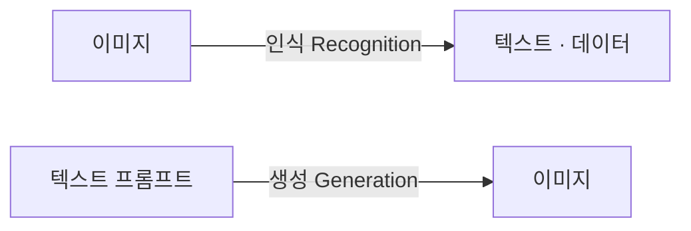
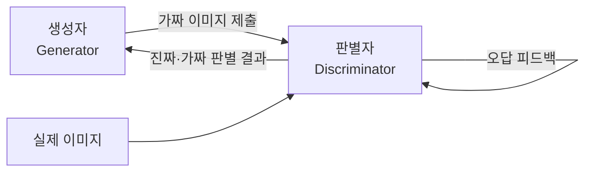
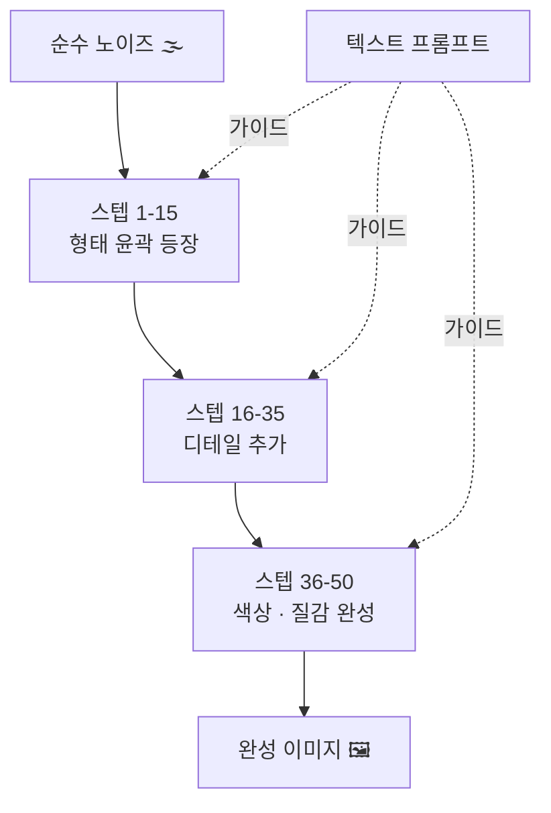
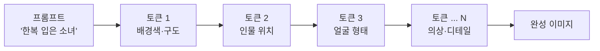

# AI로 고퀄리티 이미지와 콘텐츠 생성하기

## 2026-04-20 · 월요 AI 2회차 · @카페한디

<div class="mt-10 opacity-80 text-lg">

생성 · 편집 · 합성 — 이미지 AI의 실전 감각

</div>

<!--
커버. 지난 1회차 참석자 확인. 오늘은 "이미지"가 주역이라는 점 강조.
-->

---

# 오늘의 흐름

| 파트 | 내용 | 시간 |
|---|---|---|
| **이미지 AI 이해하기** | GAN · Diffusion · AutoRegressive | 25분 |
| **서비스 지형과 비용** | 주요 서비스 비교, Nano Banana | 20분 |
| **주의사항** | 프라이버시 · 진위 · 워터마크 | 10분 |
| **실연 + 사용해보기** | 프롬프트 6요소, inpainting | 30분 |
| **14가지 실전 기법** | 선별 시연 및 프롬프트 공유 | 25분 |
| **Q&A** | 자유 질의응답 | 10분 |

<!--
1회차와 연속성. 오늘의 흐름을 보여주며 청중이 전체 그림을 갖게 한다.
-->

---
layout: section
---

# 이미지 AI 이해하기

## 세 가지 방식과 원리

---

# 인식 vs 생성 — 두 방향의 AI

<div grid="~ cols-2 gap-8" class="mt-8">

<div>

**이미지 인식 (Recognition)**

- 사진 속 얼굴 찾기
- 영수증 · 서류 읽기
- CT · X-ray 판독
- 카메라 앱 "인물 모드"

이미지를 **읽는다**

</div>

<div>

**이미지 생성 (Generation)**

- 텍스트로 그림 그리기
- 사진 편집 · 합성
- 스타일 변환
- 빈 공간 채우기

이미지를 **만든다** ← 오늘의 주제

</div>

</div>



<div class="mt-2 opacity-70 text-sm">

"이 사진을 수채화로 바꿔줘" = 인식 + 생성이 한 인터페이스에서 만난다

</div>

<!--
1회차 LLM의 "다음 토큰 예측"이 이미지로 확장. 지난 시간과의 연결선.
-->

---
layout: image
image: /images/1.1-recognition-vs-generation.png
backgroundSize: contain
---

---

# 이미지 생성 AI의 세 가지 방식

<div grid="~ cols-3 gap-4" class="mt-8 text-sm">

<div class="p-4 border rounded border-slate-300">

### GAN
**생성자 ↔ 판별자** 경쟁

한 번에 결과 출력. 빠름.

제어 방향 잡기 어려움.

*StyleGAN · FaceApp*

</div>

<div class="p-4 border-2 rounded border-blue-400 bg-blue-50">

### Diffusion
**노이즈 → 이미지** 역복원

단계별 생성. 편집 강력.

**현재 주류.**

*SD · DALL·E · Midjourney*

</div>

<div class="p-4 border rounded border-yellow-400 bg-yellow-50">

### AutoRegressive
**토큰 단위** 순차 생성

대화 맥락 유지.

텍스트 렌더링 강함.

*GPT Image · Nano Banana*

</div>

</div>

<div class="mt-6 opacity-80 text-sm">

서비스 이름이 뉴스에 나올 때 → **어느 방식인가**를 물어보자

</div>

<!--
세 방식을 기억하는 것이 이 강의의 첫 번째 목표.
-->

---

# GAN — 경쟁으로 배운 AI

두 AI가 서로를 이기려 훈련하며 실력이 올라간다



<div grid="~ cols-2 gap-8" class="mt-6 text-sm">

<div>

**학습 구조**
- **생성자**: 판별자를 속일 만큼 진짜 같은 이미지 생성 연습
- **판별자**: 진짜 이미지와 생성 이미지를 구별 연습
- 서로 경쟁 → 둘 다 점점 능숙해짐

</div>

<div>

**강점 · 약점**
- ✅ 생성 속도 빠름 (한 번에 완성)
- ✅ 얼굴·초상화 고해상도에 강함
- ❌ 원하는 방향으로 제어가 어려움
- ❌ 학습 불안정 ("모드 붕괴")

**대표**: StyleGAN, FaceApp, DeepFake 계열

</div>

</div>

<!--
GAN의 핵심 직관: 위조지폐 만드는 사람 vs 감식하는 경찰. 둘 다 실력이 는다.
-->

---
    

# Diffusion — 안개 속에서 형체가 드러난다

<div grid="~ cols-2 gap-8" class="mt-4">

<div>

**두 단계의 학습**

**[학습]** 실제 이미지에 노이즈를 조금씩 더해 기록  
→ "이미지가 어떻게 망가지는지" 학습

**[생성]** 순수한 노이즈에서 출발  
→ 프롬프트를 나침반 삼아 **역방향으로 복원**  
→ 20-50 스텝 반복

**단계가 있다 = 개입이 가능하다**
- inpainting: 특정 부분만 바꿔치기
- img2img: 이미지를 씨앗으로 변형
- ControlNet: 윤곽선·자세 등 구조 제어

</div>

<div>



</div>

</div>

<!--
안개 속에서 형체가 드러나는 느낌. 이 "단계"가 Diffusion의 편집력을 만든다.
-->

---
layout: image-right
image: /images/1.2-diffusion-steps.png
backgroundSize: contain
---

# Diffusion 단계별 시각화

노이즈 → 형태 → 디테일 → 완성

프롬프트가 각 단계의 **방향을 잡아준다**

<div class="mt-6 text-sm">

| 단계 | 진행 내용 |
|---|---|
| 초기 (1-10) | 전체적인 구도·색상 구역 결정 |
| 중반 (11-30) | 물체의 형태, 배치 확정 |
| 후반 (31-50) | 텍스처, 세부 묘사, 색감 조정 |

</div>

<div class="mt-6 opacity-80 text-sm">

이미지를 "한 번에 그리는" GAN과 달리,
Diffusion은 **여러 번의 수정**으로 완성한다

</div>

<!--
실제 Diffusion steps 이미지를 보며 직관적으로 이해시킨다.
-->

---

# AutoRegressive — 대화로 그리는 그림

텍스트를 한 글자씩 예측하듯, 이미지를 **작은 조각(토큰) 단위로** 순서대로 채운다



<div grid="~ cols-2 gap-8" class="mt-4 text-sm">

<div>

**가장 큰 강점 — 맥락 기억**

```
[첫 번째 메시지]
한복 입은 소녀 그려줘.

[두 번째 메시지]
같은 소녀, 이번엔 안경 씌워줘.

[세 번째 메시지]
배경을 벚꽃길로.
```

← 대화 히스토리가 그림에 반영된다

</div>

<div>

**또 다른 강점**

- **텍스트 렌더링** — 로고, 간판, 인포그래픽
- **레퍼런스 합성** — 인물+배경+의상 조합
- **일관성 유지** — 동일 캐릭터 반복

**약점**
- 생성 속도 상대적으로 느림
- 세밀한 아트 스타일은 Diffusion 우세

**대표**: GPT Image (ChatGPT), Gemini Image / **Nano Banana**

</div>

</div>

<!--
1회차에서 다룬 LLM의 "다음 토큰 예측"이 이미지 영역으로 그대로 확장된 것.
-->

---

# 세 방식 비교

| 기준 | GAN | Diffusion | AutoRegressive |
|---|---|---|---|
| 생성 속도 | ⚡ 빠름 | 🕐 중간 | 🐢 느림 |
| 편집 제어성 | 낮음 | **높음** | 중간 |
| 텍스트 렌더링 | 약함 | 개선 중 | **강함** |
| 대화 맥락 유지 | 없음 | 낮음 | **높음** |
| 학습 안정성 | 불안정 | 안정 | 안정 |
| 대표 서비스 | StyleGAN, FaceApp | SD, DALL·E, MJ | GPT Image, Nano Banana |

<div class="mt-6 opacity-80 text-sm">

한 서비스에 묶이기보다, **작업 성격에 따라 섞어 쓰는** 것이 효율

</div>

<!--
표를 보며 "내 작업에는 어느 방식이 맞을까" 질문 유도.
-->

---
layout: statement
---

세밀한 제어·스타일은 **Diffusion**

대화·글자·맥락은 **AutoRegressive**

<!--
오늘의 핵심 문장. 도구를 고를 때 이 한 줄로 판단한다.
-->

---
layout: section
---

# 서비스 지형과 비용

## 어디서 쓸 것인가

---

# 2026 이미지 AI 서비스 지형

<div class="flex justify-center items-center mt-2">

</div>

<div class="mt-2 text-center text-sm opacity-70">

이 시장은 **6개월 단위**로 판이 뒤집힌다

</div>

<!--
지도를 보여주며 포지션 설명. 쉬움↔정교함, 생성↔편집.
-->

---

# 주요 서비스

<div grid="~ cols-2 gap-6" class="mt-4 text-sm">

<div>

**🟢 OpenAI**  
DALL·E → **GPT Image** (ChatGPT 안)  
텍스트 렌더링 최강. 대화형 편집.

**🔵 Google**  
Imagen → Gemini → **Nano Banana**  
속도·일관성. 한국어 자연스러움.

**🟣 Midjourney**  
심미성의 대명사. 웹 + Discord.  
포스터·아트 작업에 강함.

</div>

<div>

**🟡 Stable Diffusion**  
오픈소스. 로컬 설치 가능.  
Automatic1111 · ComfyUI · Civitai.  
완전한 제어 + 무제한 생성.

**🔴 Seedream (ByteDance)**  
중국어권·인물 합성 강점.  
한국에서는 간접 접근.

</div>

</div>

<div class="mt-6 p-3 bg-blue-50 border border-blue-200 rounded text-sm">

💡 **현실적 추천**: Gemini 주력(무료·빠름) + Midjourney 보조(포스터·고품질)

</div>

<!--
일반 사용자 기준 현실적 추천. 전문가용 로컬 SD는 따로 언급.
-->

---

# 작업 목적별 추천 서비스

| 하고 싶은 것 | 추천 서비스 |
|---|---|
| 한글 로고 · 간판 · 인포그래픽 | **ChatGPT (GPT Image)** · Nano Banana |
| 사실적 사진 합성 · 인물 편집 | **Gemini** (대화형 편집 강점) |
| 포스터 · 일러스트 · 감성 이미지 | **Midjourney** |
| 캐릭터 일관성 · 시리즈 작업 | **Nano Banana** · ChatGPT |
| 무제한 생성 · 스타일 완전 제어 | **Stable Diffusion** (로컬 설치) |
| 빠른 첫 시도 (무료) | Gemini · Bing Image Creator |

<div class="mt-5 p-3 bg-blue-50 border border-blue-200 rounded text-sm">

처음엔 **Gemini로 시작** → 특정 목적이 생기면 전문 서비스 추가

</div>

<!--
서비스별 점수 매기기보다 "어떤 작업에 어떤 서비스" 매칭이 더 실용적.
-->

---
layout: image-right
image: /images/2.3-cost-comparison.png
backgroundSize: contain
---

# 구독 · 크레딧 · 무료

**무료 티어**
- Gemini — 일일 제한 있는 무료
- Bing Image Creator — DALL·E 3 무료
- SD 로컬 — 설치 후 무제한 무료

**크레딧 모델**
- Midjourney Fast Hours
- DALL·E API 호출당

**구독 모델**
- ChatGPT Plus $20/월
- Gemini Advanced ₩29,000/월
- Midjourney Basic $10/월

<div class="mt-4 text-sm">

| 사용량 | 추천 |
|---|---|
| 가끔 (월 10장) | Gemini 무료 + Bing |
| 자주 (월 50장) | Gemini Adv. or ChatGPT Plus |
| 집중 (월 200장+) | Gemini Adv. + Midjourney Basic |

</div>

<!--
필요한 달만 구독하고 끊는 습관. 연간 할인은 매일 쓰는 사람만.
-->

---

# Nano Banana — 지금 가장 화제인 이유

**정체**: Gemini 2.5 Flash Image 모델의 코드네임이 그대로 유행어화

<div grid="~ cols-2 gap-8" class="mt-4">

<div>

**왜 화제인가**
- ⚡ 속도 — DALL·E · Midjourney보다 빠름
- 💬 대화형 편집 — "배경만 바꿔줘" → 즉시
- 🎭 캐릭터 일관성 — 동일 인물 반복 유지
- 🖼️ 레퍼런스 합성 — 인물 + 배경 + 의상 조합
- 📝 텍스트 렌더링 — 한글 로고·간판 정확

</div>

<div>

**접근 방법**
1. **Gemini 앱** (가장 쉬움, 무료)
2. Google AI Studio (개발자용, 무료 티어)
3. Vertex AI (기업용 API)

**아직 아쉬운 점**
- 특정 아트 스타일은 Midjourney가 여전히 우세
- 초고해상도 출력 제약
- 일부 편집 기능은 ChatGPT Canvas가 더 직관적

</div>

</div>

<!--
오늘 실습에서 Gemini로 Nano Banana 동작을 직접 확인.
-->

---
layout: section
---

# 주의사항

## 알고 쓰면 다르다

---

# 프라이버시 — 내 사진은 어디로

클라우드형 이미지 서비스 (ChatGPT · Gemini · Midjourney) 업로드 시:

- 서버에 저장 → 일정 기간 로그 유지
- 약관에 따라 **모델 학습에 사용될 수 있음**
- 일부 서비스는 오용 감지용 사람 검토

<div class="mt-6 pl-4 pr-4 py-3 bg-orange-50 border-l-4 border-orange-400 rounded">

**실무 원칙 3가지**

1. 증명사진 · 의료 영상 · 자녀 얼굴 · 기밀 서류는 **올리지 않는다**
2. **학습 사용 opt-out** 설정 확인 (ChatGPT · Gemini 모두 제공)
3. 강한 프라이버시 요구 시 → **로컬 Stable Diffusion**

</div>

<!--
"AI가 내 얼굴로 학습"은 과장된 공포도 있지만, 실제 존재하는 위험. 업로드 전 1초 생각하기.
-->

---

# 공식 앱만 사용 · 진위 여부 확인

<div grid="~ cols-2 gap-8">

<div>

## 공식 앱만

가짜 앱 · 익스텐션이 다수 유통

**확인 방법**
- ChatGPT: 개발자 = **OpenAI, Inc.**
- Gemini: **Google LLC**
- Midjourney: **midjourney.com** 웹

제조사 공식 웹사이트에서 앱스토어 링크 확인

</div>

<div>

## 진위 여부

AI 이미지는 **전문가도 구별 어려움**

**식별 단서** (점점 무의미해짐)
- 손가락 · 글자 뭉개짐
- 배경의 비대칭 · 반복 패턴
- 눈동자 반사광 이상

**원칙**
- 중요한 판단은 **원출처 확인**
- 공유 시 "AI 생성" 명시

</div>

</div>

<!--
법률·의료 자료는 특히 조심. AI 이미지가 뉴스로 쓰이는 시대.
-->

---
layout: two-cols
---

# 워터마크 — SynthID · C2PA

**SynthID (Google)**
Gemini · Imagen · Nano Banana 이미지에 **눈에 안 보이는 워터마크** 삽입.
자르거나 압축해도 보존.

**C2PA (Content Credentials)**
Adobe · Microsoft · OpenAI 업계 표준.
"누가 · 언제 · 어떻게" 메타데이터 + 디지털 서명.
→ **contentcredentials.org** 에서 검증

**국내** — AI 생성 이미지 표시 의무화 논의 중

::right::


<!--
상업용 이미지는 워터마크 정책 반드시 확인.
-->

---
layout: section
---

# 직접 사용해보기

## 프롬프트 · 편집 · 역추출

---

# 프롬프트 6요소

<div class="mt-4">

| 요소 | 키워드 예시 |
|---|---|
| **주제 (Subject)** | "노인 부부가 공원 벤치에 앉아있다" |
| **스타일 (Style)** | 수채화 · 유화 · 3D 렌더링 · 픽셀아트 · 민화 |
| **조명 (Lighting)** | 황금시간대 · 역광 · 창가 자연광 · 스튜디오 |
| **구도 (Composition)** | 클로즈업 · 와이드 · 아이소메트릭 · 오버숄더 |
| **배경 (Setting)** | 한적한 시골길 · 90년대 아파트 · 우주 정거장 |
| **제외 (Negative)** | 글자 없이 · 흐림 없이 · 사람 없이 |

</div>

<div class="mt-6 p-3 bg-blue-50 border border-blue-200 rounded text-sm">

결과가 아쉬울 때 → **"어느 칸이 비어 있었지?"** 를 점검

</div>

<!--
6요소 전부 채울 필요 없음. 검토용 체크리스트로 사용.
-->

---
layout: two-cols
---

# 약한 프롬프트

```
한옥 마당을 그려줘.
```

<div class="mt-4 text-sm opacity-70">

무엇을? 어떤 느낌으로?
아무것도 고정되지 않음.

매번 다른 결과.

</div>

::right::

# 강한 프롬프트

```
한옥 마당. 초봄, 매화가 만개.
수묵화 스타일.
새벽의 옅은 안개.
낮은 각도, 마루에서 올려다보는 구도.
배경에 멀리 대나무 숲이 희미.
글자와 사람은 없이.
```

<div class="mt-4 text-sm opacity-70">

스타일 + 조명 + 구도 + 배경 + 제외
5개 요소가 결과를 **고정**한다.

</div>

<!--
실습 1에서 둘을 나란히 실행해서 차이를 눈으로 확인.
-->

---
layout: compare
before: /images/5.3-inpainting-before.png
after: /images/5.3-inpainting-after.png
beforeLabel: 원본
afterLabel: inpainting 후
---

# 편집 — Inpainting

**"이 부분만 바꿔줘"** 가 가능한 이유: Diffusion의 단계를 부분에만 적용

Gemini 대화형 편집:
```
방금 그린 이미지에서 사람의 옷 색깔만 빨간색으로.
```

ChatGPT: 이미지 클릭 → 영역 선택 → 지시

<!--
핵심 유지, 특정 부분만 변경. 반복 개선의 기본기.
-->

---

# 이미지 → 프롬프트 역추출

**가진 이미지의 스타일이 궁금할 때** AI에게 분석 요청

```
이 이미지의 스타일·조명·구도·색감을
프롬프트 6요소로 분해해줘.
```

**응용**: Pinterest · SNS → 캡처 → 분석 → 내 장면으로 재가공

```
위 분석을 바탕으로,
"비오는 날 지하철 플랫폼" 장면의 프롬프트 작성해줘.
```

<div class="mt-6 p-3 bg-blue-50 border border-blue-200 rounded text-sm">

Gemini · ChatGPT 둘 다 능숙. **스타일 탐구의 가장 빠른 지름길.**

</div>

<!--
마음에 드는 이미지에서 출발. 프롬프트를 처음부터 짜는 것보다 훨씬 빠름.
-->

---
layout: section
---

# 실전 기법

## 14가지 레시피에서 선별

---

# 일관된 캐릭터 유지

시리즈 일러스트 · 교보재 · 스토리북에 필수

**핵심 방법**: 첫 장에서 외모를 3줄 이상 구체적으로 고정 → **같은 대화 맥락에서** 이어가기

```
30대 한국 여성. 한복(분홍 저고리, 남색 치마). 단정한 쪽머리.
동그란 눈, 자연스러운 눈화장. 인물 사진 스타일.

[2번째] 같은 인물, 이번엔 동그란 뿔테 안경 착용.
[3번째] 같은 인물, 머리를 파란색으로 물들인 것으로.
[4번째] 같은 인물 4컷 사진관 스타일.
```

**팁**: Nano Banana(Gemini)가 캐릭터 일관성에 특히 강하다

<!--
"남자"로만 끝내면 매번 다른 얼굴. 세세한 고정이 일관성의 열쇠.
-->

---

# 일관된 캐릭터 — 한 인물, 다섯 가지 버전

<div grid="~ cols-5 gap-2" class="mt-6 text-center text-xs">

<div>

<div class="mt-1 text-slate-500">원본</div>
</div>

<div>

<div class="mt-1 text-slate-500">안경 추가</div>
</div>

<div>

<div class="mt-1 text-slate-500">파란 머리</div>
</div>

<div>

<div class="mt-1 text-slate-500">4컷 만화</div>
</div>

<div>

<div class="mt-1 text-slate-500">캐릭터 시트</div>
</div>

</div>

<div class="mt-4 text-sm opacity-80 text-center">

같은 대화 맥락에서 프롬프트를 이어가면 동일 인물이 유지된다

</div>

<!--
실제로 생성한 5장. 외모를 처음에 충분히 고정하면 이렇게 일관되게 나온다.
-->

---
layout: compare
before: /images/6.2-product-bottle.png
after: /images/6.2-product-after.png
beforeLabel: 제품 단독
afterLabel: 배경 합성 후
---

# 제품과 배경 합성

쇼핑몰 제품 사진을 찍지 않고 AI로 합성

```
[첨부 ①: 욕실 소품 배경 사진]
[첨부 ②: Pink Rabbit Body Lotion 단독 컷]

두 이미지를 자연스럽게 합성해줘.
제품은 타월 왼쪽에, 베리들과 어우러지게.
자연광, 창문 빛이 들어오는 분위기.
조명과 그림자 방향 맞춰서.
```

**팁**: 배경 씬 + 제품 두 장 따로 첨부 후 합성 요청. 그림자 방향 지정.

<!--
실제 배경 세트 없이 고퀄 제품 컷. 쇼핑몰 운영자에게 특히 유용.
-->

---
layout: compare
before: /images/6.3-food-before.jpeg
after: /images/6.3-food-after.png
beforeLabel: 식당 사진
afterLabel: 다이나믹 푸드포토
---

# 음식에 소품 추가

평범한 식당 사진 → 잡지 광고 스타일

```
[첨부: 새우 파스타 레스토랑 사진]

이 요리를 다이나믹한 광고 스타일로.
- 검정 배경
- 새우, 토마토, 치즈가 공중에 떠오르는 장면
- 극적인 조명, 잡지 광고 느낌
```

**팁**: "levitating ingredients", "flying food photo" 키워드.
찍기 어려운 연출을 AI로 대체.

<!--
전문 스튜디오가 필요한 연출을 프롬프트 한 줄로. 식당·배달앱·푸드 블로거.
-->

---
layout: image-right
image: /images/6-4-logo2x2.jpeg
backgroundSize: contain
---

# 로고 · 간판 만들기

텍스트 렌더링 강한 **GPT Image · Nano Banana**

```
카페 이름 "Caffee Handee" 로고.
- 느낌: 따뜻함, 핸드크래프트, 커피
- 스타일을 4가지로:
  미니멀 / 빈티지 / 모던 / 핸드드로잉
- 배경: 크림색, 정사각형 비율
```

→ 만든 로고를 **건물 간판**으로, **굿즈·티셔츠**로 바로 확장 가능

**팁**: 4가지 스타일 동시 요청 후 선택. 한 번에 완벽 노리지 말 것.

<!--
자영업자·소규모 사업자에게 큰 실용성. 로고 하나가 브랜드 전체를 만든다.
-->

---

# 로고 → 간판 → 굿즈까지 한 번에

<div grid="~ cols-3 gap-4" class="mt-6 text-center text-sm">

<div>

<div class="mt-2 text-slate-500">1단계: 로고 생성</div>
</div>

<div>

<div class="mt-2 text-slate-500">2단계: 건물 간판으로</div>
</div>

<div>

<div class="mt-2 text-slate-500">3단계: 티셔츠 목업</div>
</div>

</div>

<div class="mt-6 text-sm opacity-80 text-center">

로고 하나로 **브랜드 전체 비주얼**을 만들어낼 수 있다

</div>

<!--
각 단계를 별도 프롬프트로. 이전 결과를 첨부해서 이어가는 방식.
-->

---
layout: compare
before: /images/tshirt.jpeg
after: /images/tshirt-model.jpeg
beforeLabel: 티셔츠 목업
afterLabel: 모델 착용 컷
---

# 굿즈 목업 · 모델 컷

티셔츠 목업 → 모델 착용 컷, 한 단계만 더

```
[첨부: 티셔츠 목업 이미지]
이 티셔츠를 입은 20대 여성.
한국 레트로 골목, 황금빛 자연광.
캐주얼하고 자연스러운 포즈.
```

**팁**: 실제 모델 촬영 없이 **브랜드 룩북** 한 번에 완성.

<!--
로고 → 굿즈 → 모델 컷까지 모두 AI로. 실제 촬영비 대비 효과 압도적.
-->

---
layout: compare
before: /images/6-6-sketch.jpeg
after: /images/6-6-after.jpeg
beforeLabel: 연필 스케치
afterLabel: 3D 렌더링
---

# 스케치 → 3D 렌더링

손그림 디자인 초안을 실제처럼

```
[첨부: 연필 스케치]
이 의자 디자인을 실제 제작된 듯한
3D 렌더링으로 만들어줘.
- 재질: 오크 원목 + 검은 가죽 쿠션
- 조명: 스튜디오 라이팅
- 구도: 45도, 전신이 보이게
```

**팁**: 재질 키워드 2개 이상 지정하면 현실감 급상승.

<!--
가구·제품 디자인 초안 단계의 강력한 도구.
-->

---
layout: compare
before: /images/6-8-before.jpeg
after: /images/6-8-after.jpeg
beforeLabel: 2D 청사진
afterLabel: 3D 아이소메트릭
---

# 평면도 → 아이소메트릭 뷰

부동산 · 인테리어 시안 · 공간 설명

```
[첨부: 카페 2D 청사진 평면도]
이 평면도를 가구가 배치된
3D 아이소메트릭 뷰로.
- 벽 높이 2.4m
- 천장 없이 내부 공간이 보이게
- 파스텔 톤, 따뜻한 조명
```

**팁**: 로고 → 간판 → 평면도 → 3D. **브랜드 하나로 끝까지**.

<!--
부동산 중개·교육용 시안, 인테리어 제안서에 특히 유용.
-->

---

# 평면도 → 다양한 결과물

<div grid="~ cols-3 gap-3" class="mt-6 text-center text-sm">

<div>

<div class="mt-2 text-slate-500">버전 1</div>
</div>

<div>

<div class="mt-2 text-slate-500">버전 2</div>
</div>

<div>

<div class="mt-2 text-slate-500">버전 3</div>
</div>

</div>

<div class="mt-4 text-sm opacity-80 text-center">

같은 평면도 → 스타일 프롬프트만 바꿔서 여러 시안 한 번에

</div>

<!--
클라이언트에게 여러 시안을 보여줄 때. 비용 대비 효과 압도적.
-->

---
layout: compare
before: /images/gir-with-pearl-earring.jpg
after: /images/hanbok-girl-with-pearl-earring.jpeg
beforeLabel: 진주 귀걸이 소녀 (원작)
afterLabel: 조선 한복 버전
---

# 민화 · 한복 스타일 변환

명화나 인물을 한국 전통 화풍으로

```
[첨부: 진주 귀걸이 소녀 원작]
조선시대 한복 버전으로 재해석해줘.
- 분홍 저고리와 남색 치마
- 쪽머리에 비녀
- 한지 질감 배경
- 원작의 인물 구도 유지
```

**팁**: 저작권 없는 명화로 시연하면 재미와 설득력이 동시에.

<!--
한국 미술 용어(한지, 쪽머리, 비녀)를 그대로 쓰면 잘 통한다.
-->

---
layout: compare
before: /images/monarisa.jpg
after: /images/monarisa-after.jpeg
beforeLabel: 모나리자 (원작)
afterLabel: 조선 왕비 민화
---

# 민화 — 모나리자를 조선으로

```
[첨부: 모나리자 원본]
조선 왕비 민화 스타일로 변환.
- 전통 자수 문양 의상 (금색·흑색)
- 한지 질감, 낡은 배경
- 한자 캘리그래피 + 낙관 (붉은 인장)
```

**팁**: "민화", "수묵화", "한지 질감", "낙관" — 한국 미술 용어 그대로 통한다.

<!--
수묵화 버전: "수묵화 스타일로. 한지 배경, 먹선. 벚꽃 배경 소품."
-->

---
layout: compare
before: /images/6-13-before-독립운동가황병길선생.jpeg
after: /images/6-13-after.jpeg
beforeLabel: 원본 (수형 기록 사진)
afterLabel: 복원 후
---

# 오래된 사진 복원

가족 앨범 · 유품 · 역사 기록 사진

```
[첨부: 손상된 흑백 사진]
복원해줘.
- 긁힘 · 얼룩 · 손상 제거
- 얼굴 디테일은 그대로 유지
- 명암 자연스럽게 개선
- 원본의 세피아 · 빛바랜 느낌 유지
```

⚠️ 공인 · 역사 인물은 가능. 생존 개인 얼굴 업로드 전 **프라이버시 원칙** 재확인

**팁**: "과하게 선명하지 않게" — 너무 또렷해지면 **다른 얼굴**이 된다.

<!--
감정적·역사적 가치가 큰 작업. 독립운동가 황병길 선생 수형 기록 사진 예시.
-->

---
layout: image-right
image: /images/6-14-infographic.jpeg
backgroundSize: contain
---

# 인포그래픽 만들기

교육 · 보고서 · SNS 콘텐츠

텍스트 렌더링 강한 **GPT Image · Nano Banana**

```
"건강한 하루 루틴" 인포그래픽.
세로형, 6단계:
기상·스트레칭·아침식사·걷기·물2L·취침
각 단계에 한글 레이블 + 아이콘.
파스텔 톤 통일.
```

**팁**: 한글 텍스트는 **짧고 정확한 문구**로.
긴 문장은 글자가 깨질 수 있다.

**응용**: 학원 · 교사 · 마케터 — 하루치 콘텐츠가 10분

<!--
학원, 유튜브 썸네일, SNS 카드뉴스 등에 특히 유용.
-->

---
layout: section
---

# 정리

## 오늘의 핵심과 다음 단계

---

# 오늘의 3가지 Takeaway

<div class="mt-8 text-xl space-y-8">

<div>

**1. 세 방식을 기억하라**
GAN · Diffusion · AutoRegressive
→ 서비스 이름이 뉴스에 나올 때 "어느 방식인가"를 물어보자

</div>

<div>

**2. 주력 1 + 보조 1**
한 서비스에 묶이지 말고, 작업에 맞게 섞어 쓴다
→ Gemini 무료로 시작 + Midjourney는 포스터용

</div>

<div>

**3. 프롬프트는 6요소 점검**
주제 · 스타일 · 조명 · 구도 · 배경 · 제외
→ 결과가 아쉬울 때 "어느 칸이 비어 있었지?"

</div>

</div>

<!--
이 세 가지만 가져가면 오늘은 성공. 나머지는 집에서 해보면서 몸에 붙는다.
-->

---

# 참고 교재

<div grid="~ cols-2 gap-8" class="mt-8 text-sm">

<div class="p-5 border-2 border-blue-200 rounded-lg bg-blue-50">

📗 **이게 되네? 나노바나나 AI 비포&애프터 미친 활용법 71제**

저자: 쌩초
출판사: 골든래빗

실전 use case 71개. Before/After 사진이 풍성해 시각적으로 따라 하기 쉬움.

</div>

<div class="p-5 border-2 border-slate-200 rounded-lg bg-slate-50">

📘 **나노바나나, 돈 되는 이미지 생성의 기술**

저자: 유민
출판사: 스토리요

실무 적용 중심. 비즈니스 목적별 프롬프트 레시피 수록.

</div>

</div>

<div class="mt-6 text-sm opacity-70 text-center">

오늘 소개한 기법들은 두 책에서 더 깊이 다룬다

</div>

<!--
추가 학습 자료 소개. 시각적으로 따라하기 쉬운 책을 우선 추천.
-->

---

# 다음 회차 예고

| 회차 | 날짜 | 주제 |
|---|---|---|
| **3회차** | 4/27 (월) | AI로 나만의 음악·음원 작곡하기 |
| 4회차 | 5/4 (월) | 텍스트에서 영상까지 한 번에 |
| 5회차 | 5/11 (월) | AI로 반복 업무를 스스로 처리 |

<div class="mt-8 opacity-80">

오늘 배운 **주제 · 스타일 · 조명 · 구도** 감각은
음성 · 영상 프롬프트에도 그대로 이전됩니다.

</div>

<!--
시리즈 연결감. 이미지 → 음악 → 영상 → 에이전트.
-->

---
layout: end
---

# 감사합니다

집에서 해볼 것: 아쉬웠던 **내 일상의 3 순간**을 이미지로 만들어보기
