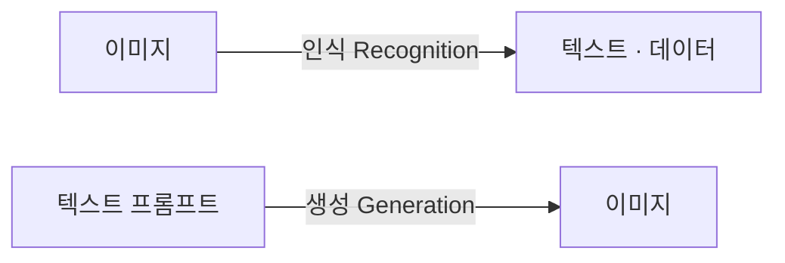
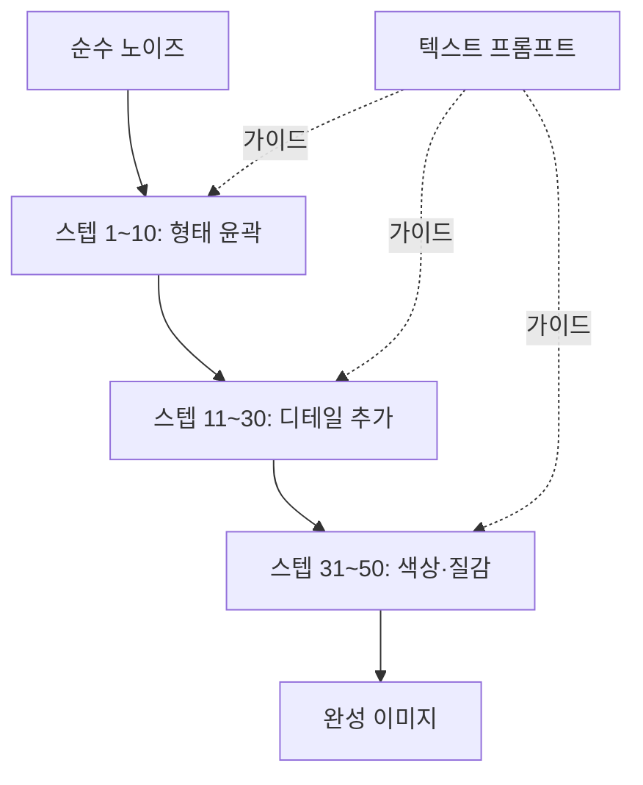
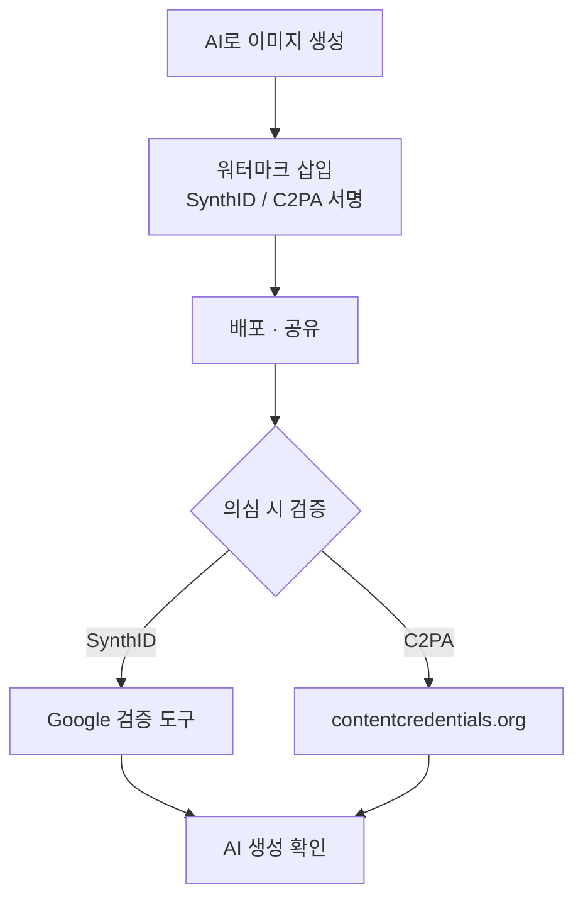

# AI로 고퀄리티 이미지와 콘텐츠 생성하기

## 2026-04-20 · 월요 AI 2회차 · @카페한디

<div class="mt-12 opacity-70">

생성·편집·합성 — 이미지 AI의 실전 감각

</div>

<!--
커버. 지난 1회차 참석자 확인. 오늘은 "이미지"가 주역이라는 점 강조.
-->

---

# 오늘의 흐름

| 파트 | 내용 | 시간 |
|---|---|---|
| **1부** | 이미지 AI 이해하기 (3 계보) | 25분 |
| **2부** | 서비스 지형과 비용 | 20분 |
| **3부** | 주의사항 (프라이버시·진위·워터마크) | 10분 |
| **4-5부** | 실연 + 직접 사용해보기 | 30분 |
| **6부** | 14가지 실전 기법 (선별) | 25분 |
| **Q&A** | 자유 질의응답 | 10분 |

<!--
1회차와 연속성. 1부는 원리, 2부는 서비스 비교, 후반은 실전.
-->

---
layout: section
---

# 1부

## 이미지 AI 이해하기

---

# 인식 vs 생성 — 두 방향의 AI

<div grid="~ cols-2 gap-8" class="mt-8">

<div>

**이미지 인식 (Recognition)**

- 사진 속 얼굴 찾기
- 영수증·서류 읽기
- CT·X-ray 판독
- 카메라 앱 "인물 모드"

이미지를 **읽는다**

</div>

<div>

**이미지 생성 (Generation)**

- 텍스트로 그림 그리기
- 사진 편집·합성
- 스타일 변환
- 빈 공간 채우기

이미지를 **만든다** ← 오늘의 주제

</div>

</div>



<div class="mt-2 opacity-70 text-sm">

"이 사진을 수채화로 바꿔줘" = 인식 + 생성 — 두 방향이 한 인터페이스에서 만난다

</div>

<!--
1회차 LLM의 "다음 토큰 예측"이 이미지로 확장된 것. 지난 시간과의 연결선.
-->

---

# 이미지 생성 모델의 세 계보

<div class="text-2xl mt-8">

**GAN → Diffusion → AutoRegressive**

</div>

<div grid="~ cols-3 gap-4" class="mt-10 text-sm">

<div class="p-4 border rounded">

### GAN
생성자 ↔ 판별자 경쟁

한 번에 결과. 빠름.

제어 어려움.

*StyleGAN*

</div>

<div class="p-4 border rounded bg-blue-50">

### Diffusion
노이즈 제거 역학습

단계별 생성. 제어 쉬움.

**현재 주류.**

*SD · DALL·E · Midjourney*

</div>

<div class="p-4 border rounded bg-yellow-50">

### AutoRegressive
다음 토큰 예측

대화 맥락 유지.

텍스트 렌더링 강함.

*GPT Image · Nano Banana*

</div>

</div>

<!--
뉴스에 서비스 이름 나오면 "어느 계보인가"를 물어보게 유도. 세 계보를 기억하는 것이 이 강의의 첫 번째 목표.
-->

---
layout: two-cols
---

# Diffusion — 노이즈에서 이미지로

1. 학습: 이미지에 노이즈를 더해가며 기록
2. 생성: 순수 노이즈 → 프롬프트 기반으로 **단계별 제거**
3. 20-50 스텝 반복

**중간에 개입 가능**
→ inpainting · ControlNet 등 강력한 편집 도구

현재 이미지 AI의 **주류**.
Stable Diffusion · DALL·E · Midjourney 모두 이 계열.

::right::



<!--
확산 과정의 직관: 안개 속에서 형체가 드러나는 느낌. 이 "단계"가 있다는 것이 Diffusion의 편집력을 만든다.
-->

---
layout: image-right
image: /images/2.4-nanobanana-conversational-edit.png
---

# AutoRegressive — 대화로 그리는 그림

텍스트 생성하듯 이미지를 **토큰 단위**로 이어 그린다.

**강점**
- 대화 맥락 유지 ("아까 그 강아지를 ...")
- 텍스트 렌더링 정확
- 로고 · 간판 · 인포그래픽

**약점**
- 생성 속도 느림
- 미세 스타일 제어는 아직 Diffusion이 우세

대표: **GPT Image (ChatGPT), Gemini Image / Nano Banana**

<!--
"Nano Banana"는 Gemini 2.5 Flash Image의 코드네임. 이 계보의 최신 얼굴.
-->

---

# 세 계보 한 표 비교

| 기준 | GAN | Diffusion | AutoRegressive |
|---|---|---|---|
| 속도 | ⚡ 빠름 | 🕐 중간 | 🐢 느림 |
| 제어성 | 낮음 | **높음** | 중간 |
| 텍스트 렌더링 | 약함 | 개선 중 | **강함** |
| 대화 맥락 | 없음 | 낮음 | **높음** |
| 대표 | StyleGAN | SD, DALL·E, MJ | GPT Image, Nano Banana |

<!--
한 서비스에 묶이기보다, 작업 성격에 따라 섞어 쓰는 것이 효율.
-->

---
layout: statement
---

세밀한 제어는 **Diffusion**

대화와 글자는 **AutoRegressive**

<!--
오늘의 핵심 문장. 도구를 고를 때 이 한 줄로 판단한다.
-->

---
layout: section
---

# 2부

## 서비스 지형과 비용

---
layout: image
image: /images/2.1-services-landscape.png
class: text-center
---

<div class="absolute top-8 left-0 right-0 text-center">

## 2026 이미지 AI 지형

</div>

<div class="absolute bottom-8 left-0 right-0 text-center opacity-80">

이 시장은 **6개월 단위**로 판이 뒤집힌다

</div>

<!--
지도를 보여주며 각 서비스가 어디에 포지션되어 있는지 설명. 쉬움-정교함 X축, 생성-편집 Y축.
-->

---

# 주요 서비스 — 5개 가문

<div grid="~ cols-2 gap-6" class="mt-4 text-sm">

<div>

**🟢 OpenAI**
DALL·E → **GPT Image** (ChatGPT 안)

**🔵 Google**
Imagen → Gemini → **Nano Banana**

**🟣 Midjourney**
심미성의 대명사. 웹·Discord.

</div>

<div>

**🟡 Stable Diffusion**
오픈소스. 로컬 설치 가능.
Automatic1111 · ComfyUI · Civitai.

**🔴 Seedream (ByteDance)**
중국어권·인물 합성 강점. 국내 간접 접근.

</div>

</div>

<div class="mt-6 opacity-80">

💡 **주력 1 + 보조 1-2** — 작업 성격에 따라 섞어 쓴다.

</div>

<!--
일반 사용자 기준 현실적 추천: Gemini 주력 + Midjourney 포스터용 보조.
-->

---

# 서비스 비교표

| 항목 | ChatGPT | Gemini | Midjourney | SD (로컬) |
|---|---|---|---|---|
| 접근성 | 쉬움 | 쉬움 | 쉬움 | 어려움 |
| 심미성 | 상 | 상 | **최상** | 모델 따라 |
| 사실감 | 상 | **최상** | 상 | 상 |
| 텍스트 렌더 | **최상** | 최상 | 중 | 중 |
| 편집 (inpainting) | 상 | **최상** | 중 | **최상** |
| 일관성 | 상 | **최상** | 상 | **최상** |

<div class="mt-6 text-sm opacity-70">

한국어 프롬프트는 모두 잘 통함. Midjourney만 영어가 조금 더 정확.

</div>

<!--
"가격"은 다음 슬라이드에서 별도. 여기선 품질·기능만.
-->

---
layout: image-right
image: /images/2.3-cost-comparison.png
---

# 구독·크레딧·무료

**크레딧 모델** — 한 장당 차감 (Midjourney Fast, DALL·E 개별)

**구독 모델** — 월 정액 (ChatGPT Plus $20, Gemini Advanced ~₩29,000)

**무료 티어** — Gemini 일일 무료, Bing Image Creator (DALL·E 3 무료)

<div class="mt-6 text-sm">

| 사용량 | 추천 조합 |
|---|---|
| 가끔 (10/월) | Gemini 무료 + Bing |
| 자주 (50/월) | Gemini Adv. 또는 ChatGPT Plus |
| 집중 (200+) | Gemini Adv. + Midjourney Basic |

</div>

<!--
필요한 달만 구독하고 끊는 습관. 연간 할인은 매일 쓰는 사람만.
-->

---

# Nano Banana — 2025-26의 화두

**정체**: Gemini 2.5 Flash Image 모델의 코드네임이 그대로 고유명사화

<div grid="~ cols-2 gap-8" class="mt-6">

<div>

**강점**
- ⚡ 속도 — DALL·E·MJ보다 빠름
- 💬 대화형 편집 — "배경만 바꿔줘"
- 🎭 일관성 — 동일 캐릭터 반복
- 🖼️ 레퍼런스 합성 — 인물+배경+의상 조합

</div>

<div>

**접근 경로**
1. Gemini 앱 (가장 쉬움)
2. Google AI Studio
3. Vertex AI (기업용 API)

**한계**
- 특정 아트 스타일은 MJ가 여전히 우세
- 초고해상도 출력 제약

</div>

</div>

<!--
오늘 실습에서 Gemini로 Nano Banana 동작을 직접 확인한다.
-->

---
layout: section
---

# 3부

## 주의사항 4가지

---

# 3.1 프라이버시 — 내 사진은 어디로

클라우드형 이미지 서비스 (ChatGPT · Gemini · Midjourney) 업로드 시:

- 서버에 저장 → 일정 기간 로그
- 약관에 따라 **모델 학습에 사용될 수 있음**
- 일부 서비스는 오용 감지용 사람 검토

**실무 원칙**

1. 증명사진 · 의료 영상 · 자녀 얼굴 · 기밀 서류는 **올리지 않는다**
2. **학습 사용 opt-out** 설정 확인 (ChatGPT·Gemini 모두 제공)
3. 강한 프라이버시 필요 시 → **로컬 Stable Diffusion**

<!--
"AI가 내 얼굴로 학습"은 과장된 공포도 있지만, 실제 존재하는 위험. 업로드 전 1초 생각하기.
-->

---

# 3.2 공식 앱만 · 3.3 진위 여부

<div grid="~ cols-2 gap-8">

<div>

## 3.2 공식 앱만

가짜 앱·익스텐션 다수 유통

**확인 방법**
- ChatGPT: 개발자 = OpenAI, Inc.
- Gemini: Google LLC
- Midjourney: midjourney.com 웹 또는 공식 앱

제조사 공식 웹사이트 → 앱스토어 링크

</div>

<div>

## 3.3 진위 여부

AI 이미지는 전문가도 구별 어려움

**식별 단서** (점점 무의미해짐)
- 손가락 · 글자 뭉개짐
- 배경의 비대칭 · 반복
- 눈동자 반사광

원칙
- 중요한 판단은 **원출처 확인**
- 공유 시 "AI 생성" 명시

</div>

</div>

<!--
법률·의료 자료는 특히 조심. AI 이미지가 뉴스로 쓰이는 시대.
-->

---
layout: two-cols
---

# 3.4 워터마크 — SynthID · C2PA

**SynthID (Google)**
Gemini·Imagen·Nano Banana 이미지에 **눈에 안 보이는 워터마크**.
자르거나 압축해도 보존.

**C2PA (Content Credentials)**
Adobe · MS · OpenAI 업계 표준.
"누가·언제·어떻게" 메타데이터 + 서명.
→ contentcredentials.org 에서 검증

**국내** — AI 생성 이미지 표시 의무화 논의 중

::right::



<!--
상업용 이미지는 워터마크 정책 반드시 확인. 배포하기 전 한 번 더 점검.
-->

---
layout: section
---

# 5부

## 직접 사용해보기 — Gemini / ChatGPT

---

# 프롬프트 6요소

<div class="mt-4">

| 요소 | 키워드 예시 |
|---|---|
| **주제 (Subject)** | "노인 부부가 공원 벤치에 앉아있다" |
| **스타일 (Style)** | 수채화 · 유화 · 3D · 픽셀아트 · 민화 |
| **조명 (Lighting)** | 황금시간대 · 역광 · 창가 · 스튜디오 |
| **구도 (Composition)** | 클로즈업 · 와이드 · 오버더숄더 · 아이소메트릭 |
| **배경 (Setting)** | 한적한 시골 · 90년대 아파트 · 우주 정거장 |
| **제외 (Negative)** | 글자 없이 · 흐림 없이 · 사람 없이 |

</div>

<div class="mt-6 opacity-80">

결과가 아쉬울 때 "어느 칸이 비어 있었지?"를 점검

</div>

<!--
6요소 전부 채울 필요 없음. 검토용 체크리스트로 사용.
-->

---
layout: two-cols
---

# 약한 프롬프트

```
한옥 마당을 그려줘.
```

::right::

# 강한 프롬프트

```
한옥 마당. 초봄, 매화가 만개.
수묵화 스타일.
새벽의 옅은 안개.
낮은 각도, 마루에서 올려다보는 구도.
배경에 멀리 대나무 숲이 희미.
글자와 사람은 없이.
```

<!--
실습 1에서 둘을 나란히 실행해서 차이를 눈으로 확인.
-->

---
layout: image-right
image: /images/5.3-inpainting-after.png
---

# 5.3 편집 — inpainting

**Inpainting**: "이 부분만 바꿔줘"
**Outpainting**: "이 이미지의 바깥을 확장해줘"

Gemini 대화형 편집 (강점)
```
방금 그린 이미지에서,
사람의 옷 색깔만 빨간색으로.
```

ChatGPT: 이미지 클릭 → 영역 선택 → 지시

로컬 SD: Automatic1111 Inpaint, ComfyUI Inpaint 노드

<!--
핵심은 유지, 특정 부분만 변경. 반복 개선의 기본기.
-->

---

# 이미지 → 프롬프트 역추출

**가진 이미지의 스타일이 궁금할 때** AI에게 분석 요청

```
이 이미지의 스타일·조명·구도·색감을
프롬프트 6요소로 분해해줘.
```

**응용**: Pinterest/SNS → 캡처 → 분석 → 내 장면으로 재가공

```
위 분석을 바탕으로 "비오는 날 지하철 플랫폼" 장면의 프롬프트 작성
```

<div class="mt-6 opacity-80">

Gemini · ChatGPT 둘 다 능숙함.

</div>

<!--
스타일 탐구의 가장 빠른 길. 마음에 드는 이미지에서 출발.
-->

---
layout: section
---

# 6부

## 14가지 기법 중 8가지를 시연

---
layout: image-right
image: /images/6.1-consistency-after.png
---

# 6.1 일관된 캐릭터 유지

시리즈 일러스트 · 교보재 · 스토리북

**핵심**: 첫 장에서 외모 구체적 고정 → **같은 대화 맥락**에서 이어가기

```
40대 남자, 짧은 검은 머리, 체크 셔츠,
웃는 표정.
카페에서 노트북을 보는 장면.
수채화 스타일.

[다음 턴] 같은 남자가 서점에서 책을
고르는 장면, 동일 스타일 유지.
```

**팁**: 외모 키워드 **3줄 이상** 구체화. Nano Banana가 특히 강함.

<!--
"남자"로만 끝내면 매번 다른 얼굴. 세세한 고정이 일관성의 열쇠.
-->

---
layout: image-right
image: /images/6.2-product-after.png
---

# 6.2 제품과 배경 합성

쇼핑몰 · SNS 제품 사진을 찍지 않고

```
[첨부: 흰 머그컵 실물 사진]
이 머그컵을 초여름 오후,
발코니의 나무 테이블 위에 놓고
옆에는 책 한 권과 작은 선인장.
자연광, 살짝 위에서 내려다보는 구도.
```

**팁**: 반사·그림자 방향을 말로 지정하면 합성 티가 덜 난다.

<!--
쇼핑몰 운영자에게 특히 유용. 비용 대비 효과 큼.
-->

---
layout: image-right
image: /images/6.4-logos-4-variants.png
---

# 6.4 로고 · 간판 만들기

텍스트 렌더링 강한 **GPT Image · Nano Banana**

```
가게 이름 "한디커피" 로고.
- 느낌: 따뜻함, 수공예, 자연
- 스타일: 손글씨 서체 + 커피잔 + 나뭇잎
- 배경: 투명 또는 크림색
- 비율: 정사각형
```

**팁**: 한 번에 완벽보다 **3-4개 변형 요청** 후 선택.

<!--
자영업자·소규모 사업자에게 큰 실용성.
-->

---
layout: image-right
image: /images/6.6-sketch-after.png
---

# 6.6 스케치 → 3D 렌더링

손그림 디자인 초안을 그럴듯한 결과물로

```
[첨부: 연필 스케치]
이 의자 디자인을 실제 제작된 듯한
3D 렌더링으로 만들어줘.
- 재질: 오크 원목 + 검은 가죽 쿠션
- 조명: 스튜디오 라이팅
- 구도: 45도, 전신이 보이게
```

**팁**: 재질 키워드 **2개 이상** 지정하면 현실감 급상승.

<!--
가구·제품 디자인 초안 단계의 강력한 도구.
-->

---
layout: image-right
image: /images/6.8-iso-after.png
---

# 6.8 평면도 → 아이소메트릭

부동산 · 인테리어 시안 · 공간 설명

```
[첨부: 2D 평면도]
이 평면도를 가구가 배치된
3D 아이소메트릭 뷰로.
- 벽 높이 2.4m
- 천장 없이 내부가 보이게
- 파스텔 톤, 따뜻한 조명
```

**팁**: 파스텔 팔레트 지정 → 도면의 기능 + 인테리어 감각 동시.

<!--
부동산 중개·교육용 시안에 특히 유용.
-->

---
layout: image-right
image: /images/6.12-minhwa.png
---

# 6.12 민화 스타일

한국적 정서 · 전시 · 교육 자료

```
조선 민화 까치호랑이 스타일로.
장면: 소나무 아래 고양이 두 마리.
- 평면적 구도
- 굵고 명료한 선
- 진채(주황·남색·연두)의 대비
```

**팁**: "한국 전통"처럼 넓은 말보다 **"조선 민화", "까치호랑이", "진채"** 같은 특정 키워드.

<!--
문화 특정성은 키워드의 구체성에서 나온다.
-->

---
layout: image-right
image: /images/6.13-restore-after.png
---

# 6.13 오래된 사진 복원

가족 앨범 · 유품 · 기념사진

```
[첨부: 1970년대 훼손된 흑백 사진]
복원해줘.
- 긁힘·접힘 자국 제거
- 얼굴 디테일은 그대로 유지
- 자연스러운 컬러 (과하지 않게)
- 원본의 빛바랜 느낌 살짝 남기기
```

⚠️ 프라이버시 — 가족 사진 업로드 전 **3.1** 원칙 재확인

**팁**: "과하게 선명하지 않게". 너무 또렷해지면 **다른 얼굴**이 된다.

<!--
감정적 가치가 큰 작업. 보수적으로 복원하는 것이 원칙.
-->

---
layout: image-right
image: /images/6.14-infographic.png
---

# 6.14 인포그래픽 만들기

교육 · 보고서 · SNS 콘텐츠

텍스트 렌더링 강한 **GPT Image · Nano Banana**

```
"건강한 하루 루틴" 인포그래픽.
세로형, 6단계:
기상·스트레칭·아침식사·걷기·물 2L·취침
각 단계에 한글 레이블 + 아이콘.
파스텔 톤 통일.
```

**팁**: 한글 텍스트는 **짧고 정확한 문구**로. 긴 문장은 글자가 깨진다.

<!--
학원·교사·마케터에게 특히 유용. 하루치 콘텐츠가 10분.
-->

---
layout: section
---

# 정리

## 오늘의 3가지 Takeaway

---

# Takeaway 3

<div class="mt-10 text-2xl space-y-8">

<div>

**1. 세 계보를 기억하라**
GAN / Diffusion / AutoRegressive

</div>

<div>

**2. 주력 1 + 보조 1**
한 서비스에 묶이지 말고 섞어 쓴다

</div>

<div>

**3. 프롬프트는 6요소 점검**
주제 · 스타일 · 조명 · 구도 · 배경 · 제외

</div>

</div>

<!--
이 세 가지만 가져가면 오늘은 성공. 나머지는 집에서 해보면서 몸에 붙는다.
-->

---

# 다음 회차 예고

| 회차 | 날짜 | 주제 |
|---|---|---|
| **3회차** | 4/27(월) | AI로 나만의 음악·음원 작곡하기 |
| 4회차 | 5/4(월) | 텍스트에서 영상까지 한 번에 제작 |
| 5회차 | 5/11(월) | AI로 반복 업무를 스스로 처리 |

<div class="mt-8 opacity-80">

오늘 배운 "주제·스타일·조명" 감각은 음성·영상 프롬프트에도 그대로 이전됩니다.

</div>

<!--
시리즈의 연결감. 이미지 → 음악 → 영상 → 에이전트.
-->

---
layout: end
---

# 감사합니다

집에서 해볼 것: 이미지 한 장이 아쉬웠던 **내 일상의 3 순간**
